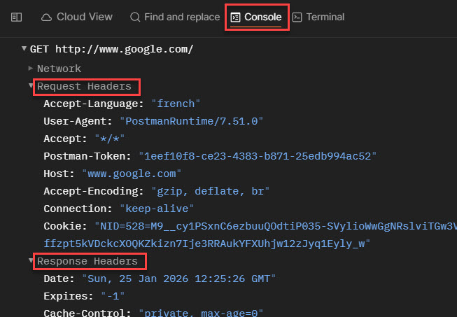

## Headers

- Headers are part of both the **HTTP request message** and the **HTTP response message**.  
- They are used to provide **meta-information** (information about the data being sent).  
- Some headers are automatically generated.
- We can see more information about headers on Postman Console, bothe request and response headers

 

---

## Content-Type Header

- Present in both **request** and **response** headers.  
- Indicates the type of content being sent (by the client or server).  
- Common content types:
  - **HTML** → `text/html`
  - **JSON** → `application/json`
  - **XML** → `text/xml`, `application/xml`

---

## Authorization Headers

- Headers can be used for **security purposes**.  
- Security credentials are often sent in headers.  
- Some APIs require credentials before allowing access.
- If we give this URL "httpbin.org/bearer" in GET method in Postman, first it will throw 401 UnAuthorized error, then if we select Authorization in request part and bearer token from dropdown and give some token name and then submit, now we'll be able to get the response. 

**Example:**  
When posting something on Facebook, the server must confirm that you are the rightful owner of the account, so authorization information must be included.

### Status Code
- **401 – Unauthorized** → credentials are required to access the URL.

### Bearer Token
- A type of token used to identify yourself when communicating with an API.