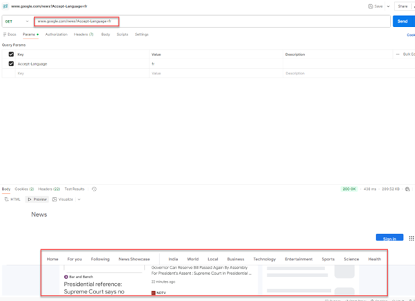
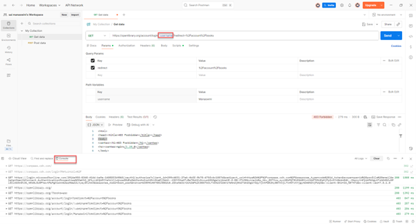

## Query Parameters

- **Query** – used to search  
- **Parameter** – a value used to refine or filter the search
- If we search for api in Google, in URL we'll get something like this "https://www.google.com/search?q=api", if we remove 'q' part from URL and if we change name of the parameter 'q' to something else, then it would throw 404 Not found error.
- There is always a predefined set of query parameters that are accepted by the server, if change that parameter it can't recognize it.

### Example URL
`https://example.com/students?name=john&age=17`

### Explanation
- `?name=john&age=17` → **Query string** (part of the URL)  
- `?` → indicates that parameters will follow the URL  
- `name` → parameter name (key)  
- `john` → value  
- `&` → used to add multiple parameters  

### Additional Example
Here, `q` is the parameter name:  
`?q=searchword`

## Path Parameters

- **Path** – location of a resource  
- **Parameter** – a value you can set (acts like a variable)

### Example URL
`https://example.com/students/john/grades?order=asc`

### Explanation
- `https` → protocol  
- `example.com` → domain name  
- `/students/john/grades` → path  
- `john` → value (no parameter name shown; could be replaced with another value like "mark")  
- `?order=asc` → query string  

### Important Note
When you see things like `:username` or `{username}` in documentation, they are **just placeholders** for values.  
They are not actually sent in the URL—only the value is sent.

#### Examples of Path Parameter Conventions
`/customers/:customerId/orders/:orderId`
`/customers/{customerId}/orders/{orderId}`

These indicate that `customerId` and `orderId` must be replaced with their actual values in real URLs.

