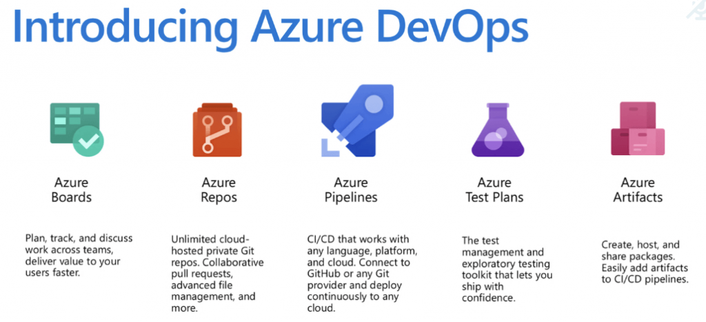
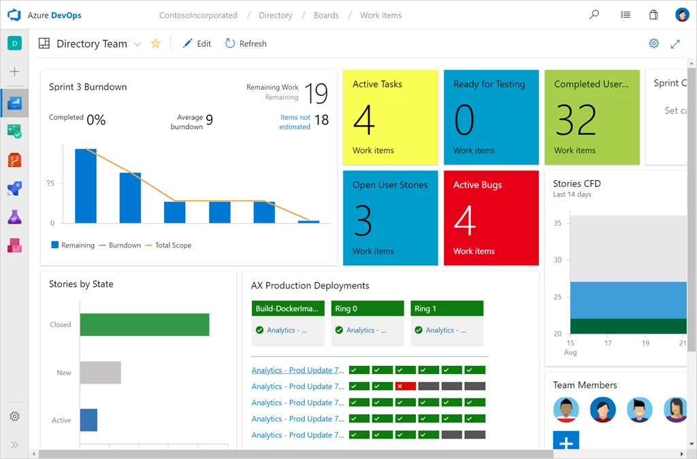
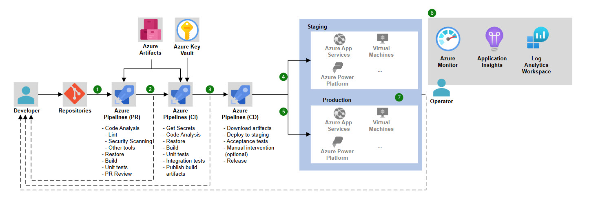
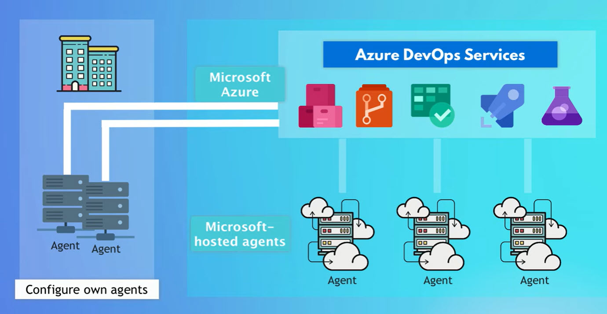
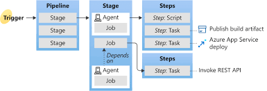
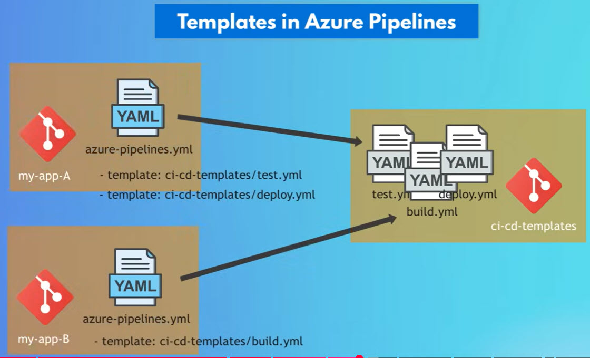
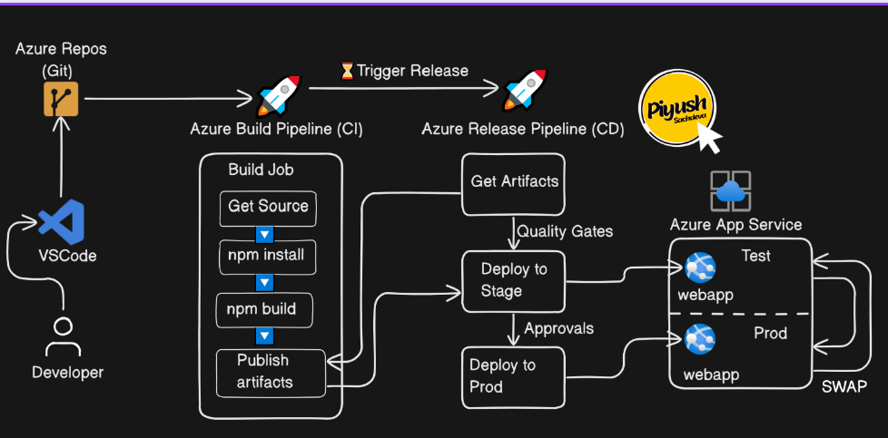
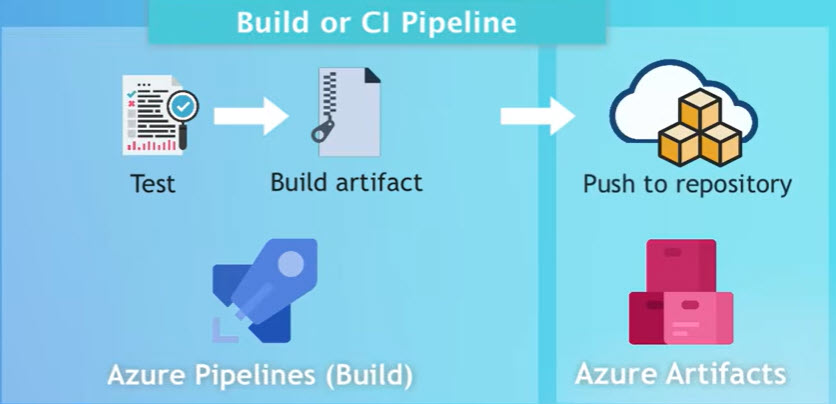

# Azure DevOps

Azure DevOps is a Software as a Service platform from Microsoft that helps teams plan work, write code, test it, and deliver software—all in one place.



Think of it as a toolbox for the entire software development lifecycle. It was extended from the existing services and tools and renamed as Azure Devops.
 


## What Azure DevOps Is (in simple terms)

Azure DevOps helps teams answer these questions:
- What should we build? → planning & tracking
- Where is the code? → source control
- Is the code working? → automated builds & tests
- How do we release it safely? → deployments & monitoring


## Main Components of Azure DevOps

Azure DevOps is made of 5 core services:

### Azure Boards – Plan & Track Work

Developers takes the planned task and develop it, in that process they may have questions. so Azure Boards are used for communication between Developers, testers, product owners etc. It gives overview and transparency (who is working on what, on what stage it is in, progress/deployment status).



- Used for:
  - Tasks, bugs, user stories
  - Sprint planning
  - Kanban boards
- Example: “Fix login bug” → assign to a developer → track progress → mark done
 

### Azure Repos – Store Your Code  

Used to host code in private Git repos (GitHub, GitLab, BitBucket,...). Different companies may use different Git workflows, with Azure Repos we have tool to implement any workflow that we choose.
- Used for:
  - Git repositories
  - Code reviews (pull requests)
  - Branching (main, dev, feature branches)
- Example: Developers work on a task → creates a feature branch → when done creates a pull request/push code → review it → if it's good → merged safely into main branch


### Azure Pipelines – Build & Deploy Automatically (CI/CD)

- After the code is merged to main branch, we want to realease this new feature to end users, but before that we need to test code changes, if everything is fine we produce an artifact that we can deploy.
- We have Azure Pipelines for building CI pipeline, by writing pipelines in YAML file.
- We can host this pipeline configuration (YAML file) with rest of the our application code in Git project.
- Uses **Steps** (smallest building block of pipelines, can be scripts/tasks).
- Example:  
```YAML
trigger:
- main
pool:
   vmImage: 'ubuntu-22.04'
variables:
   buildConfiguration: 'Release'
steps:
- script: dotnet test
  displayName: Run unit tests
- script: dotnet build --configuration ${buildConfiguration}
  displayName: Build application
- script: docker build -t my-image:v1.0
  displayName: push image
```



- Instead of writing scripts we can use tasks (pre-created script offered as convenience, no need to remember commands), that we have in Azure pipeline and add it to YAML file.
- In reality we use cases for multiple Jobs in pipeline like executing tests on two different OS (or) testing and deploying application on Linux machine, but need Database for the application to run on windows.
- If we have one job, we don't need to explicitly define it, but when we have multiple pipelines, define within **Jobs** (run series of steps in different environments) attribute.
- Example:  
```YAML
jobs:
# job 1
- job: Run on Windows
pool:
  vmImage: 'windows-latest'
steps:
- script: dotnet test
  displayName: Run unit tests
# job 2
- job: Run on Linux
pool:
  vmImage: 'ubuntu-latest'
steps:
- script: dotnet test
  displayName: Run unit tests
```
- Each job runs on an **Agent** (machine executing steps of pipeline). All steps in a Job run on same Agent.
- Agent is selected from an Agent pool like pool of windows/Linux/Mac machines where you want to run it. And these Agents are connected to Azure Devops services platform.
- Azure offers managed Agents, lets Microsoft manage the whole setup including main service which holds configuration and machines that execute pipelines.
- We can configure our own Agents or mix of both.



-Since it is a managed service , we have to pay for services and resources, but Azure provides free tire to get started.
- Multiple tasks run at same time, testing different parts of application. So, no need to wait for each other to complete, they all can run at once.
- **Stage** (logical boundary in pipeline), each stage contains one or more jobs, by default they run one after the other.



- New application version will not directly be deployed production environment instead deployed to intermediate environments like Dev and testing.
- For Deployment steps it's recommended to use special deployment Job.
- Example:  
```YAML
stages:
# stage 1
- stage: Build
  jobs:
  - job: Test and Build
    steps:
    - task: DotNet Core CLI@2
    ...
    - task: Docker@2
    ...
# stage 2
- stage: Deploy Dev
  jobs:
  - Deployment: Deploy to development
    steps:
    - task: AzureWebApp@1
    ...
# stage 3
- stage: Deplot Test
  jobs:
  - job: Deploy to Test
    steps:
    - task: AzureWebApp@2
    ...
#stage 4
- stage: Deploy Prod
  jobs:
  - job: Deploy to Production
    steps:
    - task: AzureWebApp@3
    ...
```
- Used for:
  - Continuous Integration (CI): build & test code automatically
  - Continuous Deployment (CD): deploy to servers or cloud
- Example: Push code → pipeline runs tests → deploys to Azure automatically
- Supports:
  - Any language (Java, .NET, Python, Node.js, etc.)
  - Any cloud (Azure, AWS, GCP, on-prem)

#### Azure Pipeline Template

- code for different environments like Deploy to Development, Deploy to Production etx, is looking mostly same only few specific values to that environment is different.
- If we have multiple applications and all have same pipeline logic instead of repeating code, we can extract the common configuration logic which was written properly and reuse it into our YAML file of the applications that we need.
- We can make it generic so there won't be any hardcoded values specific to environment.
- We can split our entire pipeline into multiple individual files and store/manage them in their dedicated repository and all pipelines can reference them.



- In Azure Devops pipeline YAML syntax, we can put any code that is repeated and extract it in what's called a **template** (reusable piece of configuration that can be referenced in different pipelines).
- Template is a seperate file and can be refernced in pipeline using Template attribute.
- We can specify parameters and their data types in template, can create templates for Jobs, stages or steps and we can have templates within templates.
- Example:  
```YAML
stages:
- stage: DEploy Dev
  parameters:
    env: Dev
  jobs:
  - job: Deploy
    environment: $({parameters.env})
    steps:
    - task: AzureWebApp@1
      inputs:
        appName: myapp
        package: '$(Syetm.DefaultWorkingDirectory/**/*.zip)'
- stage: Deploy Test
  jobs:
  - template: /Deploy/Jobs/deploy.yml
  parameters:
    env: Test
- stage: Install
  jobs:
  - job: npminstall
  ...
  - template: templates/stage1.yml
  - template: templates/stage2.yml

```

#### Release Piplines



- Azure DevOps can also be built on a seperate pipleine called Release Pipeline. It is used for cases like deploying existing Artifacts from Artifact repo directory.
- Classic UI is original way for creating pipelines, we won't use YAML file.
- We can have seperate pipelines for CI and CD.
- Many CI and CD platformas like Jenkins, GitLab CI/CD has one pipeline for whole process. same YAML file and one UI unit for both.
- We need to have atleast one single CI/CD pipeline defined in YAML and can take benefits of scripting whole pipeline and making use of reusable templates.
- The Artifact source can be from build pipeline or from other sources as well.

#### Azure Pipeline Environments

- When we have multiple enironments for multiple application, it may become difficult to have an overview of what branch is deployed, where or when code was last deployed to specific environment and so on.
- That's the reason we reason we use Environment feature which is part of Azure pipelines and can view deployment history of multiple environments where application get deployed.
- We can create Environment in Azure Devops which will map to Deployment environment, we can configure in our pipeline to which Devops environment you wnat to deploy to.


### Azure Test Plans – Test Your App
- We need to extensively test our code changes before deploying to production like Funtional Test, Integration Test, Load Test, etc.
- We have Test Plans - A browser based test management tool. where we have a unified and Centreal view of our test cases. We can add, view and run test cases from Kanban Board.
- Used for:
  - Manual testing (we need to specify test steps and expected outcomes, tester will go through those steps and perform application testing)
  - Automated test tracking (runs tests within azure pipelines)
  - Test case management
- Example: Tester follows test steps → logs pass/fail → links bugs to work items


### Azure Artifacts – Manage Packages



- Artifacts differ based on programming language used for writing application.
- Used for:
  - Storing packages (NuGet, npm, Maven, Python, etc.) from public and private sources
  - Sharing libraries inside your team
- stores artifacts produced by CI pipeline by connecting and pushing to Azure Artifacts.
- In modern Software Development we use Docker, Docker images are stored in special Container Registries
- Example: Team shares a common logging library securely


## How Everything Works Together (Simple Flow)

All progress is visible to the whole team.

1. Plan work in Azure Boards
2. Write code in Azure Repos
3. Push code → Azure Pipelines builds & tests it
4. Deploy automatically to production
5. Test & track bugs using Test Plans