# Creating Azure DecOps account

- Go to this website https://azure.microsoft.com/en-us/products/devops and sign up, it asks for email, address, card details, company name (if you are using comapany laptop), PAN etc.
- After Sign in search for Azure DevOps Organisation and create a organisation.
- while creating organization it might throw an error like below, as I am working in my company laptop and could be because we selected the free tier option.  
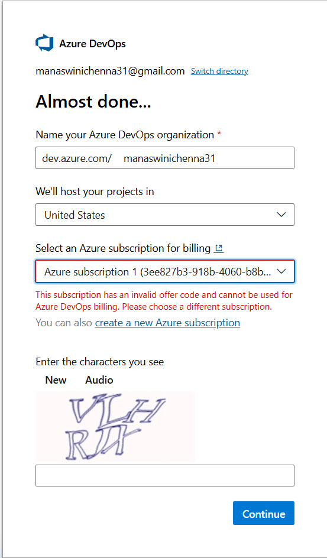
- Then it will ask to move to pay as you go as shown below, and we need to move to it otherwise you will not be able to create an organisation.  
 - You only pay if:
   - You use paid Azure resources (Avoid: Virtual Machines, Databases, App Services and Kubernetes, etc.)
   - You exceed free DevOps limits
 - Azure DevOps free includes:
   - Self Hosted Agents
   - Create Azure DevOps organization
   - 5 users
   - Azure repos and Boards
   - Free Build/YAML/CI pipeline (1,800 minutes per month (≈ 30 hours))
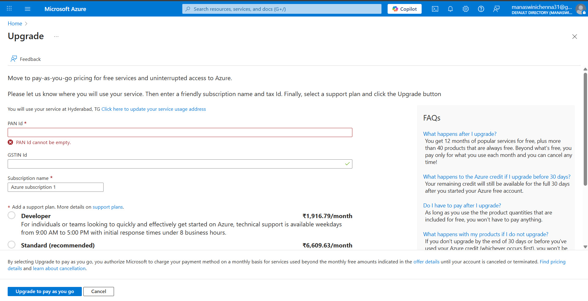
- We can even create budgets to not get charged for using their serves by setting the budget and it's percentage.  
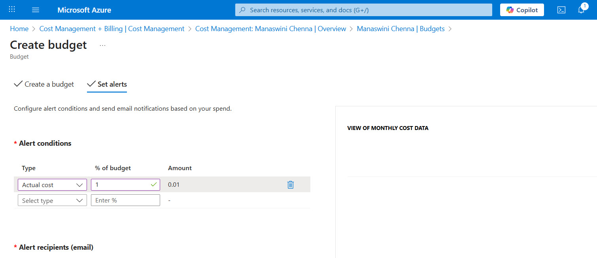
- Even while creating project you'll not be able to find the public option, because of Organization policy restriction  
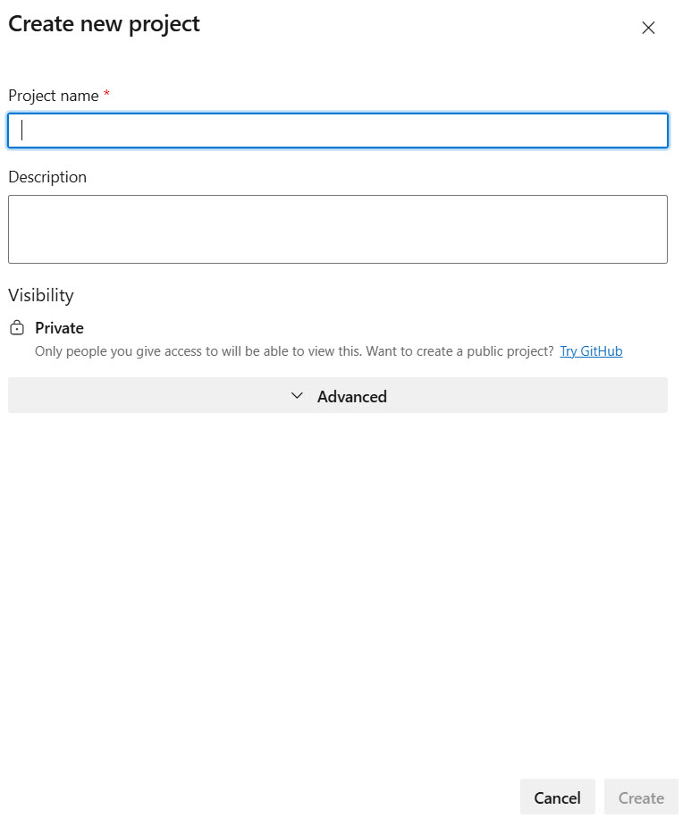


# Running code using Application Server

- After creating project, we need to download maven project from any online repo (https://github.com/rahulshettyacademy/MavenHelloWorld) or create it and build it to get the war file.  
**In VS code**  
  - git clone https://github.com/rahulshettyacademy/MavenHelloWorld
  - Go to github, create a new repostory with the same name as online repo, come to VS code go to that repo.
  - git remote -v (Lists all configured remotes and their URLs, -v means verbose → show more details.)
  - git remote set-url origin https://github.com/manaswini3103/MavenHelloWorld (Changes URL of an existing remote.)
  - git branch -M main (renames master branch with main branch)
  - git push -u origin main
  - Or we can go to github repositories, click on create new repositry then click on import a repositoy and copy the URL of the repository that you want to import 
  - then run: mvn clean install
  - we will get the .war file inside webapp>target folder.
- We need to download a application server, we are downloading apache tomcat. Go to this website https://tomcat.apache.org/download-90.cgi and download 64bit windows zip according to the windows configuration.
- unzip the file to desired folder in program files and place the .war file in **webapps** folder.
- Then we need to start the application server, go to bin folder and double click on **startup** file.
- Then a terminal will open and server will be starting, if we get any error stating port 8080 is already blocked give the below commands taken from stack overflow:  
netstat -ano | findstr :8080  
taskkill /PID processID(1234) /F  
and trigger the startup file again
- Go to browser and give **localhost:8080/warfilename**, example: localhost:8080/webapp, Local host will automatically point to your local IP address.


# Azure Pipelines

- So when we change something in the code and commit it, automatically the build should be triggered means it should test and run making sure nothing is breaking with the new changes.
- And run **mvn clean install** and a **.war** file should be created for deploying into application server.  
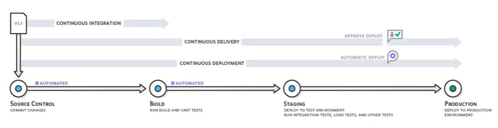
- Go to the Azure Devops Organization, and your project. Then go to pipelines and create a new pipelines,  select GitHub -> repository -> configure your pipeline (select maven) -> output: a YAML file is created (we can change the **pool name** and **JDK version** if it not matching according to our requirements) -> save it, commit to main branch -> then the created YAML file will be commited to our Git repo.
- Then run the pipeline by selecting our branch, we could get an error like below, then we need to fill a form by going to https://aka.ms/azpipelines-parallelism-request or wan create our own agent.  
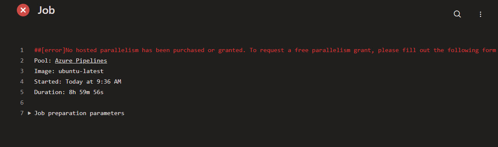

## Self Hosted Agent

- We can wait after filling the form it would take some days or we can create a **Self Hosted Agent** (machine you control that runs your Azure DevOps pipeline jobs instead of Microsoft’s hosted machines.)
- To create Self Hosted Agnet, go to Project settings → Agent pools → Create Self-hosted pool  
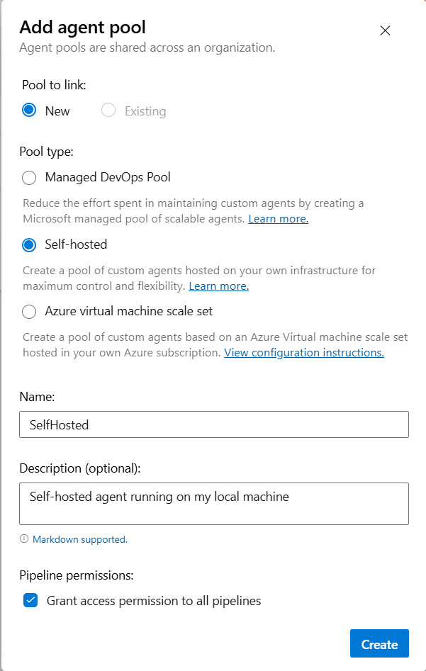  
Then we'll go to apgent pools and download for windows.
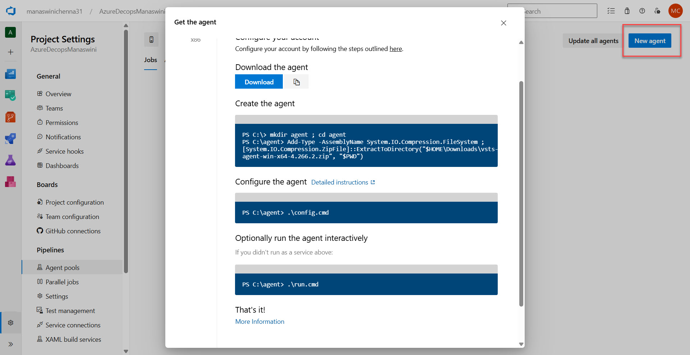
- create a folder in 'C' drive named agent and place that zip file in there, then we need to create **Personal Access Token** got to this URL https://dev.azure.com/manaswinichenna31/_usersSettings/tokens and click New Token, fill the details as below, name could be anything, then check the boxes for
  - Agent Pools: Read & manage (find this by clicking show more)
  - Build: Read & execute
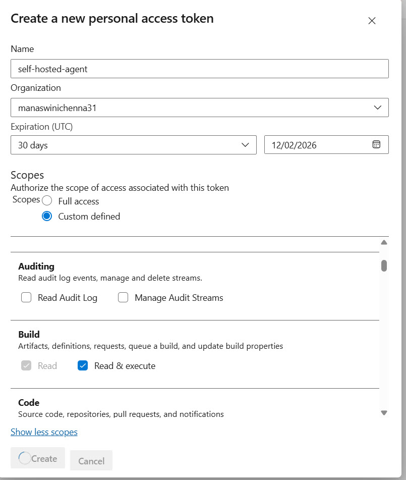  
Then copy the token it will be displayed only for once
- Then open the terminal/windows power shell and give the below commands  
  PS C:\agent> .\config.cmd  
    ___                      ______ _            _ _  
  / _ \                     | ___ (_)          | (_)  
  / /_\ \_____   _ _ __ ___  | |_/ /_ _ __   ___| |_ _ __   ___  ___  
  |  _  |_  / | | | '__/ _ \ |  __/| | '_ \ / _ \ | | '_ \ / _ \/ __|  
  | | | |/ /| |_| | | |  __/ | |   | | |_) |  __/ | | | | |  __/\__ \  
  \_| |_/___|\__,_|_|  \___| \_|   |_| .__/ \___|_|_|_| |_|\___||___/  
                                     | |  
          agent v4.266.2             |_|          (commit 8bd0453)  
     
  >> Connect:  
   
  Enter server URL > https://dev.azure.com/manaswinichenna31/  
  Enter authentication type (press enter for PAT) > PAT  
  Enter personal access token > ************************************************************************************  
  Connecting to server ...  
   
  >> Register Agent:  
   
  Enter agent pool (press enter for default) > SelfHosted  
  Enter agent name (press enter for WIN-5CD5451D4Q) >  
  Scanning for tool capabilities.  
  Connecting to the server.  
  Successfully added the agent  
  Testing agent connection.  
  Enter work folder (press enter for _work) >  
  2026-01-13 19:04:24Z: Settings Saved.  
  Enter run agent as service? (Y/N) (press enter for N) >  
  Enter configure autologon and run agent on startup? (Y/N) (press enter for N) >  
  PS C:\agent> .\run.cmd  
  Scanning for tool capabilities.  
  Connecting to the server.  
  2026-01-13 19:06:13Z: Listening for Jobs  
- If it's showing Listening for Jobs then we can build the pipeline  
- Open the GitHub and change the YAML file to  
```YAML
trigger:
- main

pool:
   name: SelfHosted

steps:
- task: Maven@3
  inputs:
    mavenPomFile: 'pom.xml'
    goals: 'package'
    javaHomeOption: 'Path'
    jdkDirectory: 'C:\programfiles\Java\jdk-25.0.1'
```

## Running the Application

- Then Run the pipeline again, the build would be successfull this time. But the terminal should open to run the build pipeline and it should show "Listening for Jobs" after running ".\run.cmd".  
**Stages in the Pipeline**  
  - Initialize Job: it was run on Local machine ('WIN-5CD5451D4Q')
  - Checkout: went to git, checked everything and Checkout manaswini3103/MavenHelloWorld@main to s  
  output: Finishing: Checkout manaswini3103/MavenHelloWorld@main to s  
  for the Azure build to run we need to have the entire project in ''s' (source code)
  - Maven: it's goal is package, package gets all dependencies of project mentioned in pom.xml and runs test cases and if everything is good builds the project.  
  [INFO] Assembling webapp [webapp] in [C:\agent\_work\1\s\webapp\target\webapp]  
  whenever we run project on any machine, it creates a ''work' folder, it stores the first build .war file in above mentioned path in 's' (source code) folder.
- Now we got the .war file, we need to copy the artifact from 's' folder and publish in 'a' folder, as the project can access the 'a' directory not 's' directory. For that we need to go to pipelines, click the pipeline and edit the yaml file.
- In right side search bar search for **copy files**, select it and enter the traget path and add it.  
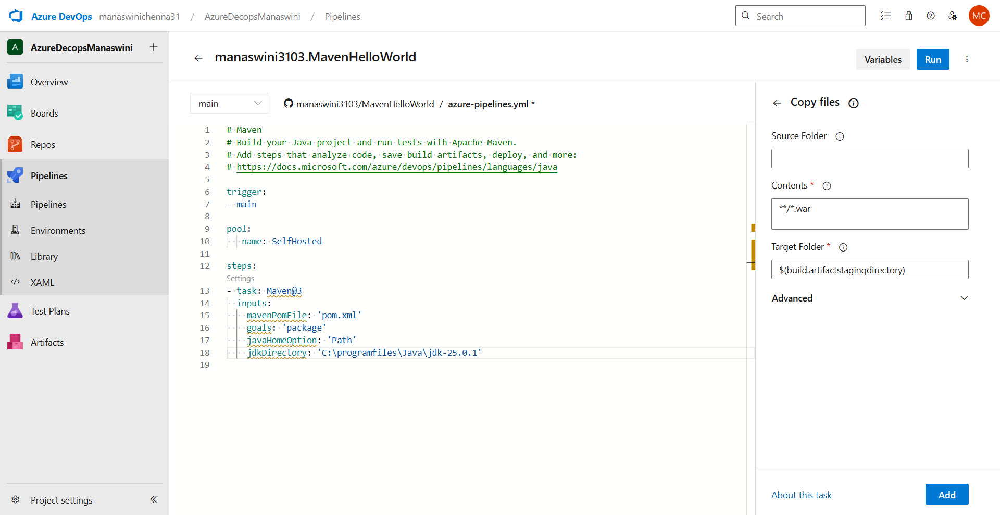 
`$(build.artifactstagingdirectory)`: local path on the agent, where any artifacts are copied to before being pushed to their destination(C:\agent\_work\a)
- Then we need to search for **publish build artifacts**, to get the artifact from 'a' directory to azure pipelines.  
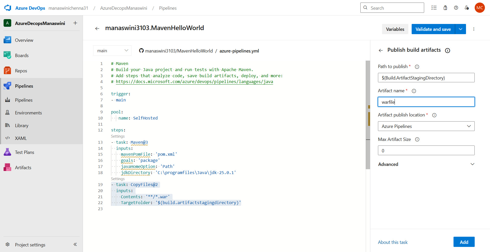  
then we need to validate and save it, saving it means committing it to git repo.

## Release Pipelines

These pipelines are generally used to deploy the build Artifacts into Agent machines.

## Azure Repos

- If we want to put our code in Azure repos, go to azure repos and we choose 2nd option
  - git pull origin main (as we changed the the YAML file in GitHub, and we don't have those changes in local)
  - git remote -v                         
    origin  https://github.com/manaswini3103/MavenHelloWorld (fetch)  
    origin  https://github.com/manaswini3103/MavenHelloWorld (push)
  - git remote add origin https://manaswinichenna31@dev.azure.com/manaswinichenna31/AzureDecopsManaswini/_git/AzureDecopsMana…  
    error: remote origin already exists.
  - git remote add azure https://manaswinichenna31@dev.azure.com/manaswinichenna31/AzureDecopsManaswini/_git/AzureDecopsMana…
  - git push -u azure main
  - git remote -v  
    azure https://manaswinichenna31@dev.azure.com/manaswinichenna31/AzureDecopsManaswini/_git/AzureDecopsMana… (fetch)  
    azure https://manaswinichenna31@dev.azure.com/manaswinichenna31/AzureDecopsManaswini/_git/AzureDecopsMana… (push)  
    origin  https://github.com/manaswini3103/MavenHelloWorld (fetch)  
    origin  https://github.com/manaswini3103/MavenHelloWorld (push)  
- Now we are creating a new pipeline linked to Azure Repo, select the Name and branch save and run the build. And if you want to run the build automatically, like when we changed some thing in our local machine we need to add, commit and push it to azure repo like **git push azure main**, then the build will automatically run.
- If we change something directly in Azure Repo we can get it back to local using **git pull azure main**
- If we want to create another Azure repo with the same source to build the docker file, go to repos, click the dropdown and create new repo
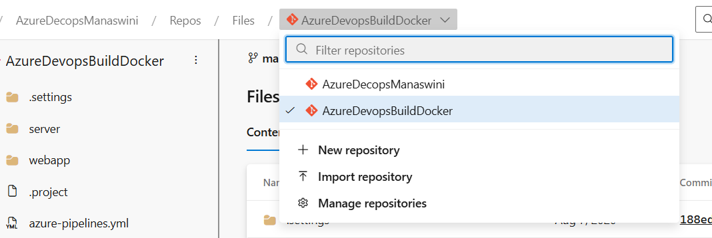
- Then to push the code, we need to create a new remote for that give, take the url from the clone option in azure repo  
**git remote add dockerrepo https://dev.azure.com/.../AzureDevopsBuildDocker/_git/AzureDevopsBuildDocker**
- Before pushing if we make any changes directly in azure repo, make sure to pull it, then push the changes  
**git push dockerrepo main**