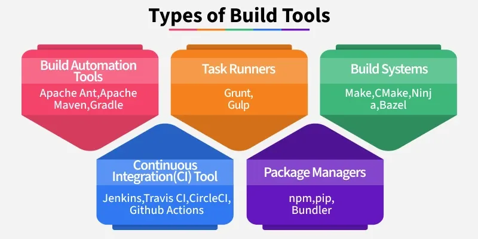

# Build Tools

Build tools are essential software that automate the tedious parts of software creation, like turning human-readable source code into executable applications, managing external libraries (dependencies), running tests, and packaging into formats like JARs or bundles and making everything for deployment, ensuring speed, consistency, and reliability in development.

## What Do Build Tools Do?

- Compile source code into executable form
- Manage dependencies and their versions
- Run automated tests during the build
- Package applications (JAR, WAR, binaries, Docker images)
- Generate versioned artifacts for deployment

## Common Build Tools by Language

| Language     | Build Tool        |
|--------------|-------------------|
| Java         | Maven, Gradle, Ant|
| JavaScript   | npm, yarn         |
| Python       | pip, poetry       |
| .NET         | MSBuild           |
| Containers   | Docker            |
| C/C++        | Make, CMake       |

## Types of Build Tools

1. **Build Automation Tools**  
These tools automate the process of converting source code into executable programs.
 - Apache Ant: Uses **XML** (Extensible Markup Language: encoding texts that is both machine- and human-readable. For storing and transferring data on the web and in many other applications) files to define build processes. It is flexible but can be verbose (a logging setting used to produce detailed, information about a system or process's internal operations).
 - Apache Maven: Introduces a standardized project structure and manages dependencies via a **pom.xml** file.
 - Gradle: Combines the best features of Ant and Maven, using a **Groovy** or **Kotlin DSL** for configuration. It is known for its performance and flexibility.

2. **Task Runners**  
Primarily used in front-end development to automate repetitive tasks like minification, compilation, and testing.
 - Grunt: A JavaScript task runner that uses a configuration file **Gruntfile.js** to define tasks.
 - Gulp: Streams files through a **series of plugins**, allowing for faster builds compared to Grunt.

3. **Build Systems**  
Designed for large-scale projects, these systems focus on speed and scalability.
 - Make: One of the earliest build tools, using **Makefile** to define build rules.
 - CMake: Generates platform-specific build files, often used in C/C++ projects.
 - Ninja: Emphasizes speed, making it suitable for projects with numerous small files.
 - Bazel: Developed by Google, it handles builds and tests across multiple languages and platforms.

4. **Continuous Integration (CI) Tools**  
Automate the process of integrating code changes, running tests, and deploying applications.
 - Jenkins: An open-source automation server that supports building, deploying, and automating software projects.
 - Travis CI, CircleCI, GitHub Actions: Cloud-based CI services that integrate with version control systems to automate testing and deployment.

5. **Package Managers**  
Manage project dependencies and can include basic build capabilities.
 - npm: The default package manager for Node.js, handling JavaScript dependencies.
 - pip: Python's package installer, managing libraries and dependencies.
 - Bundler: Manages Ruby project dependencies.

| Feature        | Apache Maven              | Gradle                          | Make                     |
|----------------|---------------------------|---------------------------------|--------------------------|
| Language       | Java / JVM                | Java / JVM / Android            | C / C++ / General        |
| Configuration  | XML (`pom.xml`)           | Groovy / Kotlin (`build.gradle`)| Makefile script          |
| Flexibility    | Low (Rigid standards)     | High (Scriptable)               | Very High (Shell scripts)|
| Performance    | Moderate                  | High (Incremental builds)       | High (Simple builds)     |
| Best For       | Standard Java applications| Complex & Android applications  | System utilities         |

## Choosing the Right Tool

- Project Size: For small scripts, Make or npm scripts are fine. For enterprise systems, use Maven or Gradle.
- Team Familiarity: If your team knows XML, Maven is a safe bet. If they prefer coding logic in build scripts, go with Gradle.
- Ecosystem: Don't fight the ecosystem. Use Gradle for Android, Maven for Enterprise Java, and npm/Vite for React.
