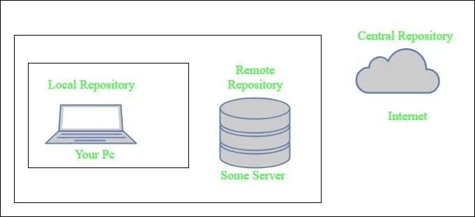

# Maven

Apache Maven is a build automation and dependency management tool, mainly used for Java-based projects. It helps developers build, test, package, and manage libraries in a standardized and automated way. Maven is declarative, we tell it what your project is (via the POM), and Maven knows how to build it using standard lifecycles.


## Key Concepts in Maven

### POM (Project Object Model)
- The pom.xml file is the heart of Maven. Maven reads the pom.xml file given by us to accomplish its configuration and operations.
- It contains everything Maven needs to know:
 - Identity: groupId (Company), artifactId (Project Name), version.
 - Dependencies: External libraries (log4j, junit).
 - Plugins: Tools to compile code, run tests, or create JARs.
- Example:
```XML
<groupId>com.example</groupId>
<artifactId>myapp</artifactId>
<version>1.0.0</version>
```

### Dependency Management
- Dependencies are defined in pom.xml, they are external Java libraries required for a Project, and repositories are directories of packaged JAR files.
- The local repository is just a directory on your machine's hard drive.
- If the dependencies are not found in the local Maven repository, Maven downloads them from a central Maven repository and puts them in your local repository.
- Handles transitive dependencies (dependencies of dependencies)

### Standard Project Structure
- Maven enforces a standard layout:  
 ├── src/main/java - your application code  
 ├── src/main/resources - config files (Properties, XML)  
 ├── src/test/java - Unit tests  
 ├── pom.xml  
 └── target/ - Maven's output folder (where the compiled classes and JARs go)  
- Easy to understand and structure is same across all projects
- config files (some text taht stores settings for application/soft, allowing users and administrators to customize the behaviour without changing the core code usinf formats XML, JSON, etc and extensions like .conf, .cfg, .ini )

### Maven Build Lifecycle
- Maven works in phases, grouped into lifecycles.
- If a lifecycle is executed using a Maven command, all build phases in that lifecycle are also executed.

### Maven Repositories (Where the JARs live)
- Repositories store project dependencies and artifacts. Maven never stores libraries inside your project folder. It downloads them from the internet to a local cache.



1. **Local repository**: A local repository is a directory on the machine of developer, which has all the dependencies and Maven only needs to download them once, even if multiple projects depends on them (e.g. ODBC). By default, maven local repository is user_home/m2 directory.  
Example - C:\Users\user_home\.m2

2. **Central repository**: Maven looks in this central repository for any dependencies needed but not found in your local repository. Maven then downloads these dependencies into your local repository.  
Example: Maven downloading the JUnit library from repo.maven.apache.org.

3. **Remote repositoryv**: Remote repository is a repository on a web server from which Maven can download dependencies. It often used for hosting projects internal to the organization. Maven then downloads these dependencies into your local repository.  
Example: A company’s internal Nexus server at http://nexus.company.com/repository/maven-releases.

### Maven Plugins
- Plugins extend Maven’s functionality.
- We can add plugins to the pom.xml file. Maven offers standard plugins, and you can also implement custom plugins in Java.
- Examples: Compiler plugin, Surefire (testing), Jar / War plugin, Docker plugin


## Maven Lifecycle

- The Maven lifecycle is a sequence of well-defined phases that Maven follows to build, test, and package a project in a consistent and automated way.
- When you run a Maven command, Maven executes all lifecycle phases up to that point in order.
- Maven Has Three Built-in Lifecycles
 - Clean Lifecycle – Cleans previous build outputs
 - Default Lifecycle – Builds and packages the project
 - Site Lifecycle – Generates project documentation
- Maven Lifecycle flow: validate -> compile -> test -> package -> verify -> install -> deploy

1. Clean Lifecycle
- Remove old build files to ensure a fresh build.
- Phases:
 - pre-clean – Preparations before cleaning
 - clean – Deletes the target/ directory
 - post-clean – Tasks after cleaning
- Common Command: **mvn clean**

2. Default Lifecycle (Main Build Lifecycle)
- Compile, test, package, and deploy the application.
- Phases
 - validate: Checks if the project is correct and all necessary information is available.
 - compile: Compiles the source code (src/main/java) and Output goes to (target/classes).
 - test: Runs unit tests (src/test/java) using a suitable testing framework (JUnit, TestNG).
 - package: Takes the compiled code and packages it into a distributable format (.jar or .war).
 - verify: Runs integration tests to ensure quality criteria are met.
 - install: Installs the package into the Local Repository (.m2), for use as a dependency in other projects locally.
 - deploy: Copies the final package to the Remote Repository (Nexus/Artifactory) for sharing with other developers.
- Common Command: **mvn install**

3. Site Lifecycle
- Generate project documentation and reports.
- Phases:
 - pre-site
 - site – Generates documentation
 - post-site
 - site-deploy – Deploys documentation to a server
- Common Command: mvn site


## Transitive Dependency Management.
- Scenario: You need Spring Boot Web. You add one dependency to your POM.
- Reality: Spring Boot Web depends on Spring Core, which depends on Logging, which depends on Jackson.
- Maven's Job: It automatically discovers this entire tree and downloads all required JARs for you.


## Snapshot vs. Release
- Release (1.0.0): A stable, unchangeable version. Once released, it is frozen forever.
- Snapshot (1.0.0-SNAPSHOT): A development version. Maven checks for updates to Snapshots daily. This allows teams to share "work in progress" code without bumping version numbers constantly.


## Build Profiles
- Profiles allow you to change the build configuration based on the environment (e.g., Dev vs. Prod).
- Example: In "Dev", you might skip signing the JAR file to save time. In "Prod", signing is mandatory.
- You define profiles in the POM and activate them via the command line: **mvn package -P prod**.


## Common Commands

| Command                 | Description                                                                 |
|-------------------------|-----------------------------------------------------------------------------|
| `mvn validate`          | It checks whether the Maven project is correctly configured.                |
| `mvn compile`           | Compiles main source code only.                                             |
| `mvn test`              | Compiles the code and runs unit tests.                                      |
| `mvn package`           | Creates the JAR/WAR file in the `target` directory.                         |
| `mvn install`           | Packages the project and copies the JAR to the local `~/.m2` repository.    |
| `mvn dependency:tree`   | Displays the full dependency tree (useful for debugging conflicts).         |
| `mvn clean`             | Deletes the `target` folder (cleans up old builds).                         |


1. PS C:\Users\chennasa\OneDrive - CDK Global LLC\Documents\GIT\onlinebookstore> mvn validate
[INFO] Scanning for projects... 
[INFO] 
[INFO] ------------------< onlinebookstore:onlinebookstore >-------------------
[INFO] Building onlinebookstore 0.0.1-SNAPSHOT
[INFO]   from pom.xml
[INFO] --------------------------------[ war ]---------------------------------
[INFO] ------------------------------------------------------------------------
[INFO] BUILD SUCCESS
[INFO] ------------------------------------------------------------------------
[INFO] Total time:  0.095 s
[INFO] Finished at: 2026-01-06T19:10:43+05:30
[INFO] ------------------------------------------------------------------------
PS C:\Users\chennasa\OneDrive - CDK Global LLC\Documents\GIT\onlinebookstore>

- Scanning for projects... :- Maven looked for a pom.xml
- <> onlinebookstore:onlinebookstore > :- GroupId: onlinebookstore, ArtifactId: onlinebookstore
- Building onlinebookstore 0.0.1-SNAPSHOT from pom.xml :- Maven successfully read pom.xml and version is 0.0.1-SNAPSHOT
- [ war ] :- This is a WAR project, It is meant to be deployed on an application server (Tomcat, etc.)
- BUILD SUCCESS :- pom.xml is valid, Project structure is correct and No configuration errors
- mvn validate checks whether the project’s configuration and structure are correct without performing compilation or packaging.

2. mvn compile  
- Running mvn compile downloaded required plugins and dependencies, copied resources, compiled Java source files into class files, and completed successfully with only compatibility warnings related to Java 8 and newer JDKs.
- It compiles main Java source code of your Maven project. Specifically Compiles files in: src/main/java
- Uses dependencies defined in pom.xml and Generates .class files.
- After a successful compile, Maven creates:  
target/  
 └── classes/  
     └── (compiled .class files)  
- we might see something like below in output  
**Downloading from central: https://repo.maven.apache.org/maven2/...**  
**Downloaded from central: ...**  
  - Maven downloaded: Build plugins (resources, compiler), Project dependencies (PostgreSQL, MySQL, Servlet API) and Transitive dependencies.
  - This happens only the first time.  
**Copying 1 resource from src\main\resources to target\classes**
  - Files from src/main/resources moved to: target/classes  
**Compiling 34 source files with javac [debug target 1.8] to target\classes**
  - Java files in src/main/java compiled and Output in target/classes
- there was three warnings after compliling
 - [WARNING] File encoding has not been set, using platform encoding UTF-8, i.e. build is platform dependent!
 - [WARNING] bootstrap class path is not set in conjunction with -source 8 not setting the bootstrap class path may lead to class files that cannot run on JDK 8  
 --release 8 is recommended instead of -source 8 -target 1.8 because it sets the bootstrap class path automatically.   
 - [WARNING] source value 8 is obsolete and will be removed in a future release
- we fixed by adding **prperties section** - This makes builds consistent across all machines. And used **release** instead of source and target - which allows to Compile as Java 8 and Use modern JDK safely
  ```XML
  <properties>
      <project.build.sourceEncoding>UTF-8</project.build.sourceEncoding>
  </properties>
  
  <build>
      <plugins>
          <plugin>
              <groupId>org.apache.maven.plugins</groupId>
              <artifactId>maven-compiler-plugin</artifactId>
              <version>3.11.0</version>
              <configuration>
                  <release>8</release>
              </configuration>
          </plugin>
      </plugins>
  </build>
  ```
- after updating we would run: **mvn compile** or **mvn clean compile** (don't use this if your git repo is in onedrive, avoid the Windows/OneDrive clean failure)

3. mvn test
Maven will execute these phases in order:
- validate
- compile (already done, so it may say “Nothing to compile”)
- test-compile (compile test classes)
- test (run unit tests)
- output:
[INFO] Scanning for projects...  
[INFO] ------------------< onlinebookstore:onlinebookstore >-------------------  
[INFO] Building onlinebookstore 0.0.1-SNAPSHOT [INFO] from pom.xml  
[INFO] --------------------------------[ war ]---------------------------------  
Downloaded from central: https://repo.maven.apache.org/maven2/org/checkerframework/checker-qual/3.5.0/  checker-qual-3.5.0.jar (214 kB at 1.9 MB/s)  
[INFO] --- resources:3.3.1:resources (default-resources) @ onlinebookstore ---  
[INFO] Copying 1 resource from src\main\resources to target\classes  
[INFO] --- compiler:3.11.0:compile (default-compile) @ onlinebookstore ---  
[INFO] Nothing to compile - all classes are up to date  
[INFO] --- resources:3.3.1:testResources (default-testResources) @ onlinebookstore ---  
[INFO] skip non existing resourceDirectory C:\Users\chennasa\OneDrive - CDK Global  LLC\Documents\GIT\onlinebookstore\src\test\resources  
[INFO] --- compiler:3.11.0:testCompile (default-testCompile) @ onlinebookstore ---  
[INFO] No sources to compile  
[INFO] --- surefire:3.2.5:test (default-test) @ onlinebookstore ---  
[INFO] No tests to run.  
[INFO] BUILD SUCCESS  
[INFO] Total time: 7.928 s  
[INFO] Finished at: 2026-01-08T16:50:11+05:30  
- No tests to run: means src\test\resources → does not exist

4. mvn package
- Copy web resources from WebContent/ and place the WAR in the target/ folder
- A new file will be created whith some name as shown below.
target/  
 └── onlinebookstore.war  
- output
Downloaded from central: https://repo.maven.apache.org/maven2/com/github/jsimone/webapp-runner/8.0.30.2/   webapp-runner-8.0.30.2.jar (9.1 MB at 8.1 MB/s)  
[INFO] Copying webapp-runner-8.0.30.2.jar to C:\Users\chennasa\OneDrive - CDK Global   LLC\Documents\GIT\onlinebookstore\target\dependency\webapp-runner.jar     
[INFO] BUILD SUCCESS  
[INFO] Total time:  27.361 s  
[INFO] Finished at: 2026-01-08T17:07:51+05:30  


5. mvn install 
- copies the .war file to C:\Users\chennasa\.m2\repository\onlinebookstore\onlinebookstore\0.0.1-SNAPSHOT.

6. To run the application we give:
- we can only open/access the web application when we run the below command 
**java -jar target/dependency/webapp-runner.jar --path /onlinebookstore target/onlinebookstore.war** 
- java: Runs the Java Virtual Machine (JVM).
- jar: Run the executable JAR file that follows.
- --path /onlinebookstore: This sets the context path (It’s the URL prefix where your app is accessible. http://localhost:8080/onlinebookstore or http://localhost:8080/onlinebookstore/index.html but we should never give http://localhost:8080/expanded/) of your web application
- target/dependency/webapp-runner.jar: This is Webapp Runner and lightweight embedded Apache Tomcat. we downloaded it using Maven (maven-dependency-plugin). It allows running a WAR file without installing Tomcat (Tomcat packaged inside a JAR).
- target/onlinebookstore: This is your web application, It contains: compiled classes, JSPs, web.xml and libraries. created by: mvn package.
  - usually the name would be "onlinebookstore-0.0.1-SNAPSHOT.war", but it was "onlinebookstore.war" as we have mentioned it in POM.XML build final name.
- after running the command, when you get the below output and the cursor is not comming out, then we need to open the above link in browser and check whether the application is running in browser.  
  - INFO: Pausing ProtocolHandler ["http-nio-8080"]  
  - If we to open the browser we need three things
    1. web server (Tomcat)
    2. Your WAR deployed into that server
    3. The server listening on port 8080
  - none of those exist unless you run a server.
- then we can press ctrl+C to come out of that