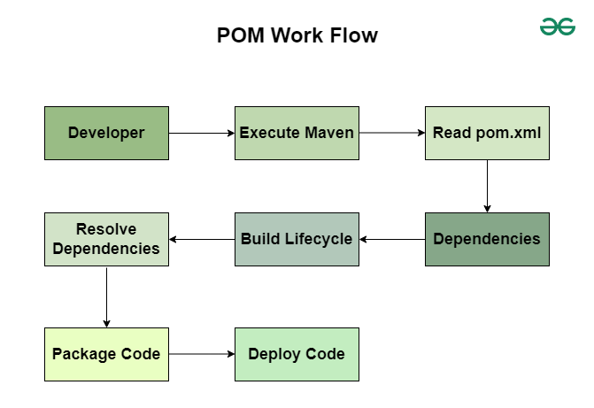

# POM (Project Object Model)

The pom.xml file is the core configuration file of a Maven project. It defines project metadata, dependencies, plugins, and build configurations required to compile, test, package, and deploy the application.

A properly structured POM file ensures consistent builds and dependency management across environments.


## POM Workflow



1. **Initialization**: Maven reads the pom.xml and initializes the project.
2. **Dependency Resolution**: Downloads all defined dependencies from repositories.
3. **Build Lifecycle Execution**: Runs phases like compile, test, package, and verify.
4. **Plugin Execution**: Executes plugin goals such as code compilation, testing, and analysis.
5. **Packaging**: Generates JAR/WAR/EAR files as defined in the POM.
6. **Deployment**: Uploads the final artifact to a remote repository or server.


## Structure of POM

Example:  
```XML
<project xmlns="http://maven.apache.org/POM/4.0.0"
         xmlns:xsi="http://www.w3.org/2001/XMLSchema-instance"
         xsi:schemaLocation="http://maven.apache.org/POM/4.0.0 
                             http://maven.apache.org/xsd/maven-4.0.0.xsd">

    <modelVersion>4.0.0</modelVersion>
    <groupId>com.geeks</groupId>
    <artifactId>spring-gateway-security</artifactId>
    <version>1.0-SNAPSHOT</version>
    <packaging>jar</packaging>

    <properties>
        <java.version>17</java.version>
        <spring-boot.version>3.2.0</spring-boot.version>
    </properties>

    <dependencies>
        <dependency>
            <groupId>org.springframework.boot</groupId>
            <artifactId>spring-boot-starter-web</artifactId>
        </dependency>
        <dependency>
            <groupId>org.springframework.boot</groupId>
            <artifactId>spring-boot-starter-test</artifactId>
            <scope>test</scope>
        </dependency>
    </dependencies>

    <build>
        <plugins>
            <plugin>
                <groupId>org.springframework.boot</groupId>
                <artifactId>spring-boot-maven-plugin</artifactId>
            </plugin>
        </plugins>
    </build>

</project>
```

### Project Information (<project>) 
- This is root element of the POM file. It contains all project-related metadata and configuration used by Maven to manage the build process.
- This line defines the XML namespaces and schema used by Maven so it can correctly understand, validate, and process the pom.xml file.  
```XML
# identifies this as Maven POM
<project xmlns="http://maven.apache.org/POM/4.0.0" #Declares default XML namespace, This XML document follows Maven POM version 4.0.0 rules
         xmlns:xsi="http://www.w3.org/2001/XMLSchema-instance" #Declares XML Schema Instance (xsi) namespace, Allows use of schema-related attributes like xsi:schemaLocation, Standard XML requirement not Maven-specific.
         xsi:schemaLocation="http://maven.apache.org/POM/4.0.0 
         http://maven.apache.org/xsd/maven-4.0.0.xsd"> # Links namespace to actual XML schema file. It's purpose is to Purpose: Validate the structure of pom.xml and Ensure correct tags and ordering. Enables IDE (auto-suggestions, error checks) and auto-completion, validation
```
- This lines tells Maven what type of file this is, which rules it follows, and where to find those rules.

### <modelVersion>
- Specifies Maven POM model version
- Always: `<modelVersion>4.0.0</modelVersion>`

### Project Coordinates
- Defines unique identifiers for your project in a Maven repository.
```XML
<groupId>com.geeks</groupId>
<artifactId>maven-pom-example</artifactId>
<version>1.0-SNAPSHOT</version>
```
- groupId: Usually your organization’s domain in reverse.
- artifactId: Project or module name.
- version: Current version of the project.

### Packaging
Defines output type: jar (default), war and pom.  
`<packaging>jar</packaging>`

### Dependencies
- Lists all external libraries your project depends on. Maven automatically downloads them from configured repositories.
- Each dependency includes- groupId: Library’s organization, artifactId: Library name and version: Library version.  
```XML
<dependencies>
    <dependency>
        <groupId>org.seleniumhq.selenium</groupId>
        <artifactId>selenium-java</artifactId>
        <version>${selenium.version}</version>
    </dependency>
</dependencies>
```

### Build
- Controls how the project is built. It Contains 
 - Plugins: Define build tools such as compiler, JAR packager, or reporting tools. Extend Maven functionality: Compilation, Testing, Packaging, Deployment.
 - Configuration: Customizes how each plugin behaves.
 - Build Directory
```XML
<build>
    <plugins>
        <plugin>
            <groupId>org.apache.maven.plugins</groupId>
            <artifactId>maven-compiler-plugin</artifactId>
            <version>3.8.1</version>
            <configuration>
                <source>${java.version}</source>
                <target>${java.version}</target>
            </configuration>
        </plugin>
    </plugins>
</build>
```

### Repositories
- Defines remote repositories from where Maven retrieves dependencies. If no repository is specified, Maven defaults to Maven Central.  
```XML
<repositories>
    <repository>
        <id>central</id>
        <url>https://repo.maven.apache.org/maven2</url>
    </repository>
</repositories>
```

### Properties
- Defines reusable variables to maintain consistency and simplify version updates. Using ${property.name} lets you reference these values across the file.  
```XML
<properties>
    <java.version>1.8</java.version>
    <selenium.version>4.6.0</selenium.version>
    <testng.version>7.4.0</testng.version>
</properties>
```

### Profile
- Allows defining environment-specific configurations such as development, testing, or production.
- Activate profiles using: **mvn clean install -Pdev**
```XML
<profiles>
    <profile>
        <id>dev</id>
        <properties>
            <environment>development</environment>
            <debug>true</debug>
        </properties>
    </profile>
</profiles>
```


## High-Level pom.xml Structure (Summary)

project  
 ├── modelVersion  
 ├── groupId  
 ├── artifactId  
 ├── version  
 ├── packaging  
 ├── dependencies  
 ├── dependencyManagement  
 ├── build  
 │    └── plugins  
 ├── repositories  
 ├── properties  
 └── profiles  

