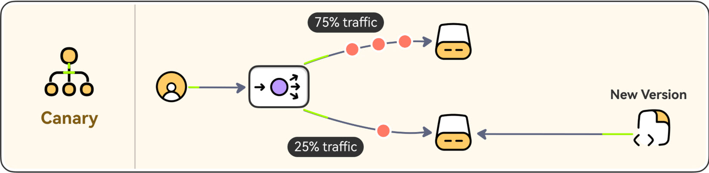

# Canary deployment

- Canary deployment is a release strategy for rolling out new software changes to a small subset of users in a production environment before a full release.
- This method significantly reduces risk by using this small group as an "early warning system" to detect potential issues in a live setting without impacting the entire user base.

## How Canary Deployment Works

The process involves gradually shifting a percentage of live user traffic to the new version, monitoring performance, and then making a decision to proceed or roll back.

1. **Plan and Create**: A new version of the application (the "canary") is deployed on a separate set of servers or infrastructure, running alongside the existing stable version (baseline).

2. **Analyze (Monitor)**: A small percentage of user traffic (e.g., 1% or 5%) is routed to the canary version via a load balancer or service mesh. Key metrics such as error rates, response times, and user behavior are closely monitored.

3. **Roll or Rollback**:
    - If successful, the traffic to the canary version is gradually increased in stages until all users are on the new version, and the old infrastructure is retired.
    - If issues are detected, the traffic is immediately switched back to the stable baseline version, limiting the impact to only the small subset of users. 

## Tools and Technologies

Canary deployments are often implemented using specific tools, especially in modern containerized environments like Kubernetes:

- **Service Meshes**: Tools like Istio or linkerd can manage fine-grained traffic routing between different service versions.
- **Feature Flagging**: Using platforms like LaunchDarkly or Optimizely allows developers to decouple code deployment from feature enablement, allowing a feature to be toggled on/off for specific users without a full deployment.
- **CI/CD Integration**: The process integrates seamlessly into continuous delivery pipelines using tools like Argo Rollouts or Spinnaker, which can automate the analysis and promotion/rollback steps.

## Key Benefits

- Reduced Risk: The primary advantage is minimizing the "blast radius" of potential bugs or performance issues to a small group of users.
- Real-World Testing: It allows teams to test the new code under actual production load and in a realistic environment, which staging environments often cannot fully replicate.
- Faster Rollbacks: If problems arise, reverting to the previous stable version is quick and easy, often just requiring a traffic re-route, minimizing downtime.
- Early User Feedback: By exposing changes to real users (or specific internal "beta" testers), teams can gather valuable insights before a full release. 