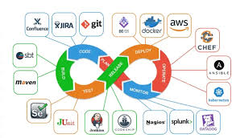

# DevOps Lifecycle

The DevOps lifecycle is a structured approach that integrates development (Dev) and operations (Ops) teams to streamline software delivery. It focuses on collaboration, automation, and continuous feedback across key phases.

## Phases of DevOps Lifecycle

1. **Plan**: This phase focuses on understanding the business needs and gathering feedback from end-users. Teams create a plan that aligns the project with business goals and ensures the right results are delivered.
- requirement gathering from business needs, project tracking (tracking tasks and documenting features) and communicating with team.

Tools: Jira, Azure Boards, Teams, GitHub Projects.

2. **Code**: In this phase, developers write the actual code for the software.
- Tools like Git help manage the code (free from security issues or bad coding practices).
- Reviewing the code.
- Collaboration via pull and merge requests.

Tools: Git, GitHub/GitLab/Bitbucket, IDEs.

3. **Build** Once the code is written, it is submitted to a central system using tools like Jenkins. This step ensures the code is compiled, and all components are integrated together smoothly.
- packages the code into deployable artifacts (are final products of your code before deployment) and store them safely.

Tools: Maven, Jenkins, Gradle, npm, GitHub Actions.

4. **Test**: The software is then tested to ensure it works properly.
- This includes different types of tests (Unit tests, Integration tests and Security tests (SAST/DAST)) like security, performance, and user acceptance.
- Tools like JUnit and Selenium are used to automate these tests and verify the software’s integrity.

Tools: Selenium, JUnit, PyTest, SonarQube.

5. **Release**: After testing, the software is ready to be released to production.
- The DevOps team ensures that all checks are passed and then sends the latest version to the production environment (live environment where end users uses the application/software).

Tools: Jenkins, GitLab CI/CD, Spinnaker, ArgoCD.

6. **Deploy**: Using Infrastructure-as-Code (IaC) tools like Terraform, the necessary infrastructure (servers, networks, etc.) is automatically created.
- Once the infrastructure is set up, the code is deployed (and event which happens multiple times) to various environments (QA, staging, production) in an automated and repeatable way.

Tools: Kubernetes, Docker, Helm, AWS/Azure/GCP CI pipelines.

7. **Operate**: Once deployed, the software is available for users. Tools like Chef help manage the configuration and ongoing deployment of the system to ensure it operates smoothly.

Tools: Kubernetes, AWS/Azure/GCP, ELK Stack, Prometheus, Grafana.

8. **Monitor**: This phase involves observing how the software is performing in the real world. Data about user behaviour and application performance is collected to identify any issues or bottlenecks.
- By monitoring the system, the team can quickly spot and fix problems that may affect performance.

Tools: Prometheus + Grafana, Datadog, New Relic, Splunk.

# DevOps toolchain overview

1. **Planning & Collaboration Tools**
- Used for project tracking, requirement gathering, and communication.  
- Tools:
    - Jira
    - Azure Boards
    - Trello
    - Confluence
    - Slack / Microsoft Teams
    - Miro
- Purpose:
    - Track tasks and user stories
    - Document features
    - Improve team communication

2. **Source Code Management (SCM)**
- Tools that store, version, and manage code.
- Tools:
    - Git (core technology)
    - GitHub
    - GitLab
    - Bitbucket
- Purpose:
    - Version control
    - Collaboration via pull/merge requests
    - Code reviews

3. **Continuous Integration (CI)**
- Automatically builds and tests code whenever developers push changes.
- Tools:
    - Jenkins
    - GitHub Actions
    - GitLab CI/CD
    - CircleCI
    - Travis CI
    - Azure Pipelines
- Purpose:
    - Catch bugs early
    - Ensure code always integrates cleanly

4. **Build & Artifact Management**
- Packages code into deployable artifacts and stores them safely.
- Tools:
    - Maven / Gradle / npm (build tools)
    - JFrog Artifactory
    - Nexus Repository
    - GitHub Packages
    - Harbor
    Docker Registry
- Purpose:
    - Build artifacts (JAR, WAR, Docker images)
    - Store and version artifacts

5. **Configuration Management**
- Automates server configuration and state management.
- Tools:
    - Ansible
    - Puppet
    - Chef
    - SaltStack
- Purpose:
    - Install software
    - Manage configurations
    - Maintain consistency across servers

6. **Infrastructure as Code (IaC)**
- Creates and manages infrastructure using code.
- Tools:
    - Terraform
    - AWS CloudFormation
    - Azure ARM / Bicep
    - Pulumi
- Purpose:
    - Automate infrastructure provisioning
    - Maintain environments consistently

7. **Containerization & Orchestration**
- Packages apps and runs them at scale.
- Tools:
    - Docker
    - Kubernetes
    - OpenShift
    - ECS / EKS / AKS / GKE
    - Helm
- Purpose:
    - Portable deployments
    - Auto-scaling
    - Self-healing infrastructure

8. **Continuous Delivery/Deployment (CD)**
- Automates deploying applications to staging/production.
- Tools:
    - ArgoCD
    - Spinnaker
    - FluxCD
    - Jenkins X
    - AWS CodeDeploy
- Purpose:
    - Automated releases
    - Canary, blue/green, rolling deployments

9. **Monitoring & Logging**
- Tracks system performance and logs for troubleshooting.
- Tools:
    - Prometheus
    - Grafana
    - ELK Stack (Elasticsearch, Logstash, Kibana)
    - Datadog
    - New Relic
    - Splunk
- Purpose:
    - Monitor health
    - Detect failures
    - Support feedback loops

10. **Security (DevSecOps)**
- Integrates security into every stage of the pipeline.
- Tools:
    - SonarQube (code scanning)
    - Snyk (dependency scanning)
    - Trivy
    - HashiCorp Vault (secrets management)
    - Aqua Security / Prisma Cloud
- Purpose:
    - Shift-left security
    - Vulnerability scanning
    - Secrets & compliance