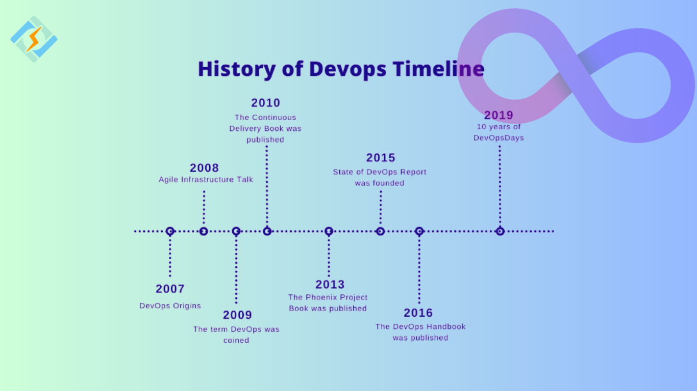

# DevOps

DevOps is a collaborative way of working where development, operations, QA (Quality Assurance), security, and other IT teams work together across the entire software lifecycle — from planning to coding, testing, deployment, and maintenance.

- QA is testing environment where software is deployed specifically for testers to verify quality, functionality, and stability before it goes to production.

## Key Goals

- Faster delivery: ship updates and features more quickly.
- Higher reliability: fewer bugs, stable releases.
- Continuous improvement: short feedback loops.
- Automation: CI/CD, configuration management, monitoring.
- Collaboration: shared responsibility for software outcomes.

## Core Practices

- Continuous Integration (CI)
- Continuous Delivery/Deployment (CD)
- Infrastructure as Code (IaC)
- Automated testing
- Monitoring & observability
- Incident response and postmortems

## Common Tools

Git, Jenkins, GitHub Actions, Docker, Kubernetes, Terraform, Ansible, Prometheus/Grafana, AWS/Azure/GCP services, etc.

# History & Evolution

1. Pre-DevOps (Before 2007): Traditional Waterfall models created silos, leading to slow, error-prone releases as Dev and Ops worked separately.
2. The Spark (2007-2009):
    - 2007: Patrick Debois notes Dev/Ops disconnects.
    - 2008: Agile infrastructure discussions begin.
    - 2009: Debois organizes "DevOpsDays," and the term is coined, inspired by talks like "10+ Deploys per Day at Flickr".
3. Early Adoption & Tools (2010-2014): Focus on CI/CD, version control (Git), and configuration management (Puppet, Chef) take hold.
4. Containerization & Cloud (2015-2019): Docker and Kubernetes revolutionize deployment, alongside wider cloud adoption.
5. Modern DevOps (2020-Present):
    - DevSecOps: Integrating security earlier in the lifecycle.
    - GitOps: Managing infrastructure via Git.
    - AI/ML: Automation and intelligence in the pipeline.
    - Standardization: DevOps becomes a core business practice. 

**Key Driver**: The Agile Movement  
DevOps grew out of Agile's need for faster iterations, extending Agile principles from just development to the entire software delivery pipeline, bridging the gap between rapid development and stable operations. 