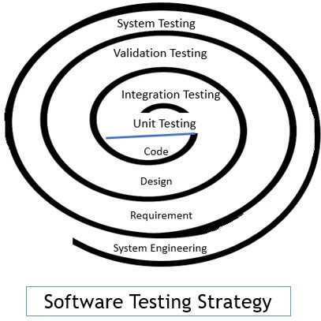

# Testing Strategies

Testing strategies are structured approaches that define what to test, how to test, and when to test in order to ensure software quality, reliability, and performance throughout the software development lifecycle (SDLC).

## Goals of Testing Strategies

- Detect defects early
- Ensure requirements are met
- Improve software quality
- Reduce cost of fixing bugs
- Increase user confidence

## Major Testing Strategies in Software

Unit → Integration → System → Acceptance

### Unit Testing
- What: Tests individual units or functions/classes
- Who: Developers, When: During development
- Fast, Easy to automate
- Example: Testing a single method
- Java: JUnit, TestNG and JS: Jest, Mocha

### Integration Testing
- What: Tests interactions between modules
- Who: Developers / Testers, When: After unit testing
- Types:Top-down, Bottom-up, Big-bang
- Spring Boot + Testcontainers and REST API tests

### System / End-to-End (E2E) Testing
- What: Tests the complete system as a whole and Real User workflows
- Who: Testers, When: After integration
- Validates end-to-end functionality using Selenium.

### Acceptance Testing
- What: Verifies system meets business requirements
- Who: Customers / QA / Product Owners, When: Before release
- Types: User Acceptance Testing (UAT), Alpha & Beta testing

| Testing Type  | What it Tests              | Scope       | Tools Examples              |
|---------------|----------------------------|-------------|-----------------------------|
| Unit          | Individual methods/classes | Small       | JUnit, TestNG,Jest          |
| Integration   | Module interaction         | Medium      | Spring Test, Testcontainers |
| System        | Full system behavior       | Large       | Selenium, Cypress           |
| End-to-End    | Real user workflows        | Very Large  | Playwright, Selenium        |
| Functional    | Business requirements      | Medium      | Manual, Cucumber            |
| Regression    | Existing functionality     | Large       | Automated test suites       |
| Smoke         | Basic application health   | Small       | CI smoke tests              |
| Performance   | Speed & scalability        | Large       | JMeter, Gatling             |
| Security      | Vulnerabilities            | Large       | OWASP ZAP, Snyk             |
| Usability     | User experience            | Medium      | Manual testing              |

## Functional Testing Strategies
1. Black Box Testing
- Tests functionality without knowing internal code
- Example: UI, API testing
2. White Box Testing
- Tests internal logic and code structure
- Example: unit tests, code coverage
3. Grey Box Testing
- Combination of both

## Non-Functional Testing Strategies
- Performance Testing: Load, stress, endurance testing, scalability.
- Security Testing: Identifying vulnerabilities.
- Usability Testing & Accessibility Testing: Ease of use and access.

## Regression Testing
- Ensure new changes do not break existing features, it's often automated.
- When: After every change

## Smoke & Sanity Testing
- Smoke: Basic build verification, Basic sanity check: “Does the app even start?”
- Sanity: Verify specific fixes
