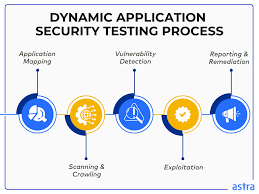

# Dynamic Application Security Testing (DAST)

- DAST is a security testing method that analyzes an application while it is running.
- Unlike SAST (which examines source code), DAST does not need access to the code.
- Instead, it tests the application from the outside, executing it and probing it dynamically.
- DAST is often called “black-box testing” because the tester (or tool) interacts with the app without knowing its internal structure.

## What DAST Does

- Run the application in a test environment
- Simulate real-world attacks (e.g., SQL injection, XSS, CSRF)
- Observe the app’s responses
- Identify exploitable vulnerabilities
- Report findings with severity levels

It behaves like an automated penetration tester.

## How DAST Works (Step-by-Step)

1. Crawls the Application  
A DAST scanner crawls the live application (web app, API) to map its structure and endpoints.

2. Sends Test Payloads  
Injects attack patterns such as:
- malicious input
- unexpected characters
- tampered requests

3. Monitors Runtime Responses  
Looks for suspicious behavior:
- error messages
- stack traces
- unusual output
- unexpected redirects

4. Identifies Real, Exploitable Weaknesses  
Because it interacts with the running system, DAST often finds issues SAST can’t.

## What DAST Can Detect

DAST is great for finding runtime and environment-based vulnerabilities such as:

- SQL Injection
- Cross-Site Scripting (XSS)
- Cross-Site Request Forgery (CSRF)
- Broken authentication / weak session IDs
- Server misconfigurations
- API endpoint vulnerabilities
- Security header issues (CSP, HSTS)
- Access control failures
- Error leakage / stack trace exposure

**It works with**  
- Web apps
- APIs
- Microservices
- Cloud-hosted services

## DAST Tools Examples

- Common DAST tools include:
- OWASP ZAP (free and widely used)
- Burp Suite (manual + automated scanning)
- Acunetix
- Netsparker
- Qualys Web Application Scanner
- Rapid7 InsightAppSec

# DAST vs. SAST (Quick Comparison)

| **Feature**       | **SAST**                   | **DAST**                            |
|------------------|----------------------------|--------------------------------------|
| **Scans**        | Source code                | Running application                  |
| **Method**       | White-box                  | Black-box                            |
| **Finds**        | Coding flaws               | Runtime flaws / misconfigurations    |
| **When to use**  | Early (shift-left)         | Later (runtime testing)              |
| **Best for**     | Developers                 | Security testers                     |

Together, SAST + DAST = strong application security coverage.