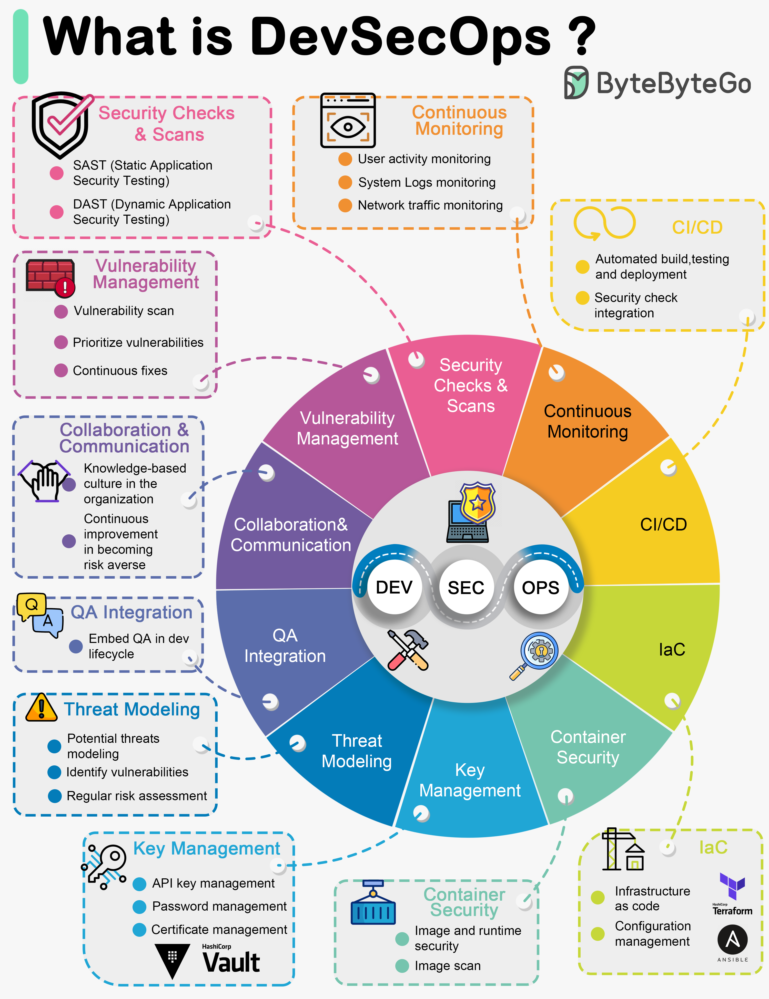

# DevSecOps

- DevSecOps (Development + Security + Operations) is a modern approach to software delivery that integrates security practices into every stage of the DevOps pipeline—from planning and coding to testing, deployment, and operations.
- Instead of treating security as a final “check” before release, DevSecOps makes it a shared responsibility across developers, security teams, and operations.

## Key principles include:

- Shift-left security: security testing starts early, during development.
- Automation: tools automatically scan code, dependencies, configurations, and pipelines.
- Continuous monitoring: systems and applications are monitored for threats in real time.
- Collaboration: dev, ops, and security teams work together, not in isolation.
- Infrastructure as Code (IaC) checks: security is applied to cloud infrastructure definitions and environments.

## Why DevSecOps Matters

1. Stops security issues early (cheaper + faster)
- Fixing vulnerabilities late in the release cycle is expensive. DevSecOps finds them while the code is still being written.

2. Reduces risk of breaches
- Early and continuous testing prevents:
    - insecure dependencies
    - misconfigurations
    - code vulnerabilities
    - exposed secrets/tokens
- This lowers the likelihood of costly security incidents.

3. Speeds up delivery  
Automation (security scans, compliance checks) enables faster, safer releases without manual bottlenecks.

4. Supports regulatory and compliance needs  
DevSecOps helps teams meet standards like GDPR, SOC 2, HIPAA, PCI DSS by integrating compliance checks into the pipeline.

5. Improves team culture  
It shifts security from being “someone else’s job” to a shared, proactive part of development.

6. Aligns security with modern cloud-native architectures  
Microservices, containers, and CI/CD pipelines require continuous, embedded security—not one-time checks.