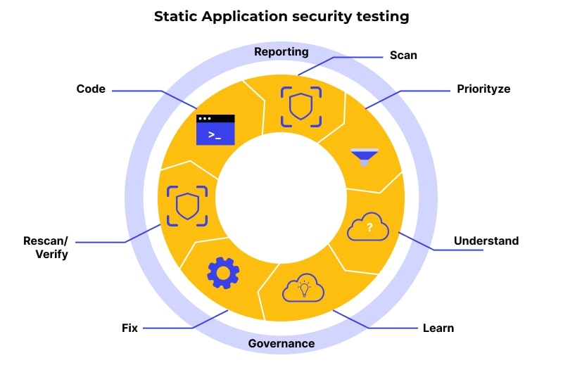

# Static Application Security Testing (SAST)

- SAST tools analyze source code, bytecode, or binaries without executing them to find security vulnerabilities early in the SDLC—typically during development or build stages.
- They help developers catch issues before the application runs, making SAST a core part of “shift-left” security.

## What SAST Tools Do

- Scan source code for insecure patterns.
- Identify vulnerabilities such as:
    - SQL injection
    - XSS
    - Hardcoded secrets
    - Insecure APIs
    - Buffer overflows
    - Broken authentication logic
- Provide remediation guidance.
- Integrate into CI/CD pipelines for automated scanning.
- Help enforce secure coding standards.
- They work similarly to an advanced code linter that focuses on security rather than style.

## How SAST Works

1. Code Parsing  
The tool parses code to build an internal model (AST—Abstract Syntax Tree).

2. Data Flow Analysis  
It tracks how data moves through the code to see if it flows into unsafe locations (e.g., user input → SQL query).

3. Rules & Signatures Evaluation  
Security rules detect known vulnerable patterns (like string concatenation in database queries).

4. Finding & Reporting Issues  
Alerts are generated with severity, location, and suggested fixes.

4. Developer Feedback Loop  
Integrated IDE plugins let developers see issues in real time.

# SonarQube

SonarQube is one of the most widely used SAST tools, known for:

1. Multi-language support  
Java, Python, JavaScript, C#, Go, PHP, Kotlin, and many others.
  
2. Deep security rule sets  
Includes OWASP Top 10, CWE, and SANS standards.

3. Code quality + security  
Besides security, it checks:  
- code smells
- bugs
- maintainability issues

4. CI/CD Integration  
Works with:
- Jenkins
- GitHub Actions
- Azure DevOps
- GitLab CI

5. Developer-friendly dashboards  
Shows:  
- vulnerability details
- severity levels
- code coverage
- technical debt

6. IDE Integration  
SonarLint extension highlights security issues directly in the editor.

## Example Issues SAST (SonarQube) Can Catch

| Vulnerability Type    | Example                                                |
|-----------------------|--------------------------------------------------------|
| **SQL Injection**     | `SELECT * FROM users WHERE id = '" + userInput + "'"   |
| **Hardcoded Secrets** | API keys stored directly in code                       |
| **XSS**               | Rendering unsanitized user input in HTML               |
| **Insecure APIs**     | Using outdated cryptographic functions                 |
| **Path Traversal**    | Concatenating file paths with user input               |