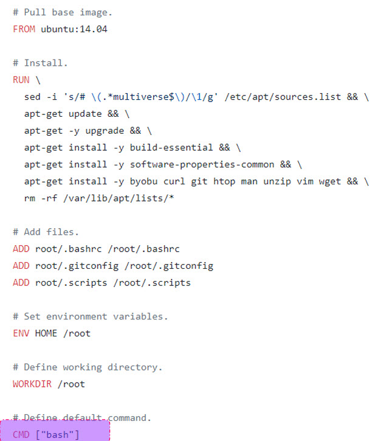
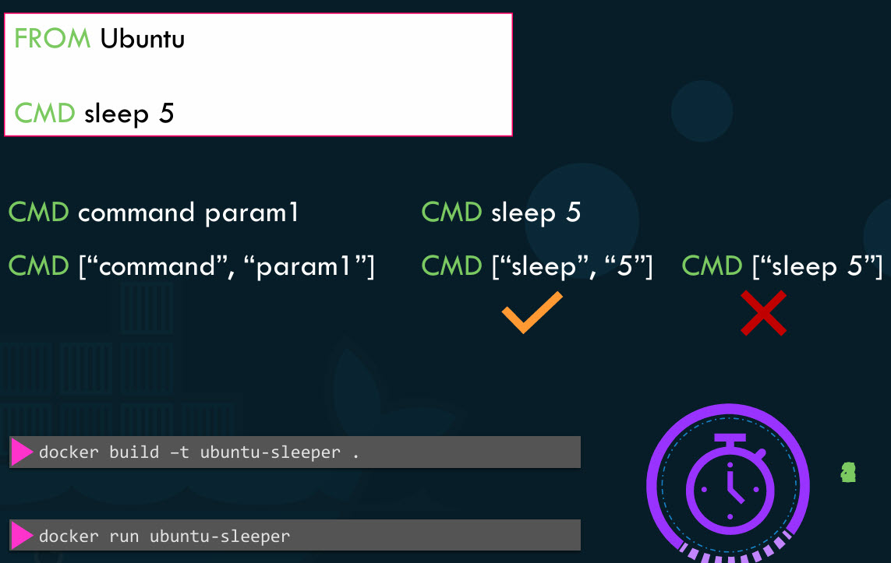
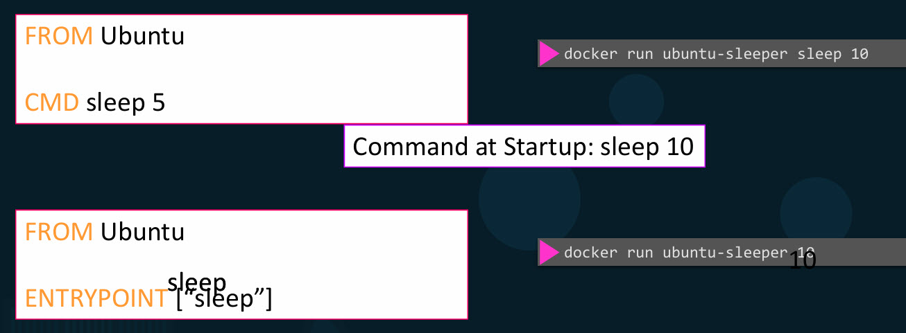
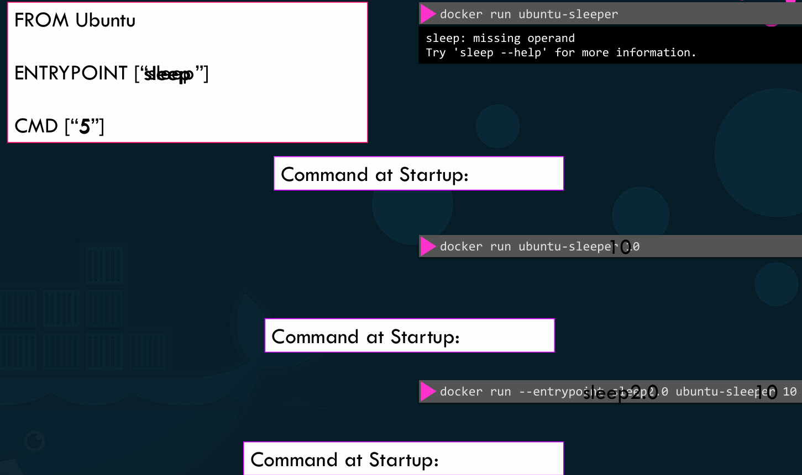

- When you run the **docker run ubuntu** command, it runs an instance of Ubuntu image and exits immediately.
- If we list the running containers, we wouldn't see the container running, it will be in exited state.
- why is that? Unlike virtual machines, containers doesn't host an OS, they run a specific task/process, such as to host an instance of a web/application/database server.
- A container only lifts as long as the process inside it is alive, if the web service inside the container is stopped or crashes, the container exits.

## who defines what process is run within the container?

- If you look at the Docker file for Docker images like 'ngnix', we'll see an instruction called CMD, which stands for Command that defines the program that will run within the container.

- Ubuntu uses Bash as the default command. Bash is not a process like a web/database server.
- It is a shell that listens for inputs from a terminal. If it cannot find a terminal, it exits.
- By default Docker does not attach a terminal to a container so it exited. since the process that was started when the container was created is finished, the container exits as well.
- So how do you specify a different command to start the container?
 - Now one option is to append a command to Docker run command, it overrides the default command specified within the image like **docker run ubuntu sleep 5**.
- how do you make that change permanent?
we want image to always run sleep command when it starts. we then create our own image from the base ubuntu image and specify a new command.

- If we wish to change the number of seconds it sleeps? One option is to run the Docker run command with the new command appended to it.

- We only want to pass in the number of seconds. container should sleep and sleep command should be invoked automatically, that is where the entry point instruction comes into play.
- The entry point instruction is like the command instruction, program will run when the container starts and whatever you specify on the command line, here it will get appended to the entry point.
- In case of the CMD instruction, the command line parameters past will get replaced entirely, whereas in case of entry point, the command line parameters will get appended.

- If we run the Ubuntu Sleeper image command without appending the number of seconds, then the command at startup will be just sleep and you get the error that the operand is missing.
- So how do you configure a default value for the command if one was not specified in the command line, that's where you would use both entry point as well as the command instruction.
- In this case, the command instruction will be appended to the entry point instruction and startup then command would be sleep five if you didn't specify any parameters in the command line, if you did then that will override the command instruction.
- For this to happen, we should always specify the entry point and command instructions in a JSON format.
- If we want to modify the entry point during runtime, say, from sleep to an imaginary, let's say sleep 2.0 command or something. In that case, you can override it by using the entry point option in the Docker run command. So startup will then be sleep 2.0 ten.

