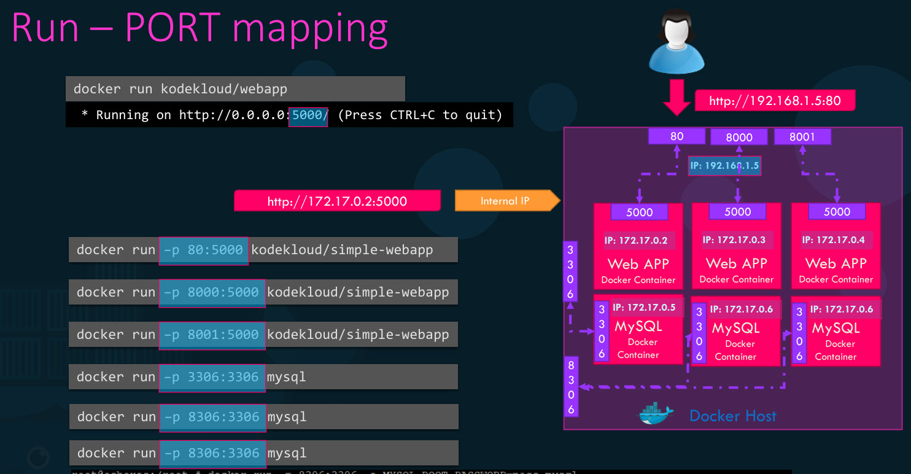
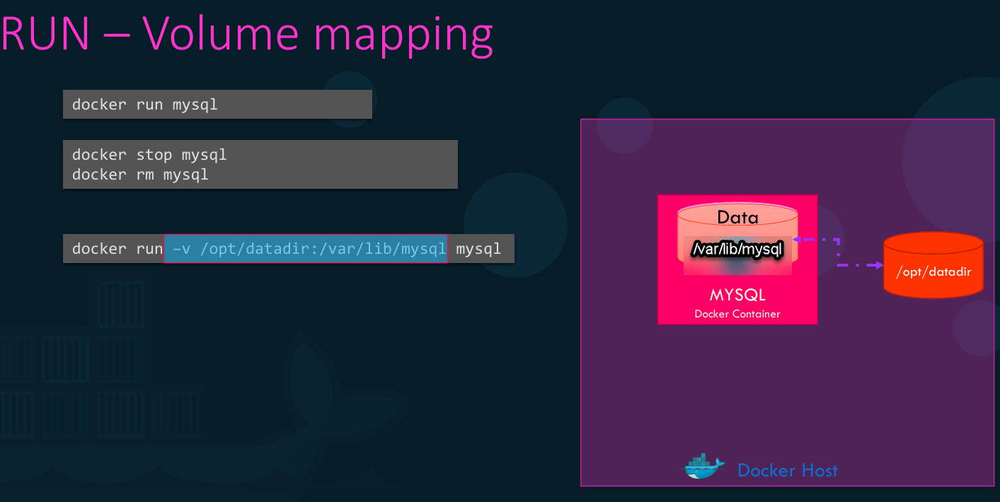
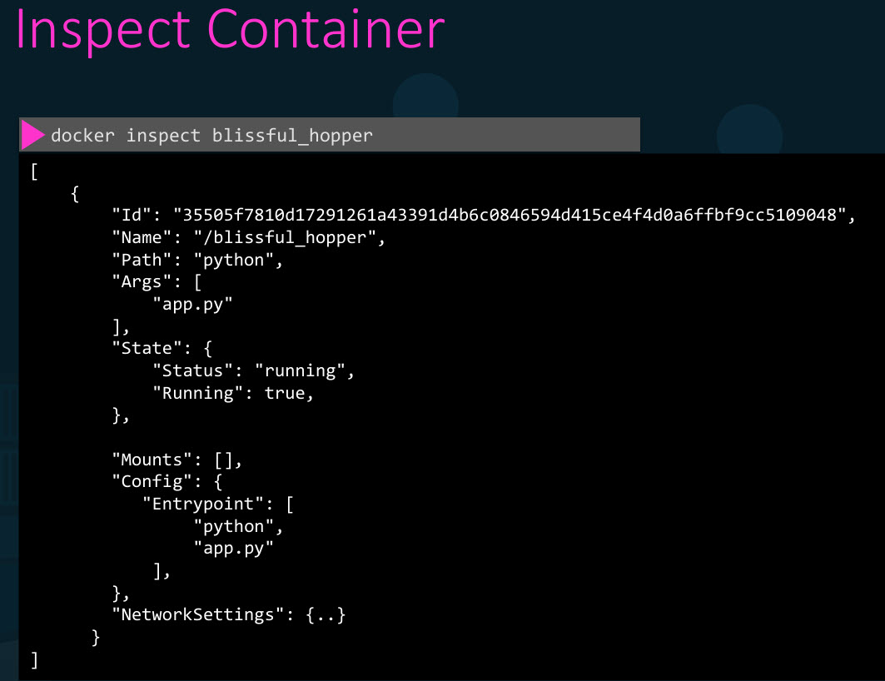

- Each container automatically gets a random container ID and name created for it by Docker.
- Containers are not meant to host an operating system, they run a specific task or process, such as to host an instance of a web server or application server or a database or simply to carry some kind of computation or analysis task.
- Once task is complete the container exits, a container only lives as long as the process inside it is alive.
- If the web service inside the container is stopped or a crash then the container exits and will be stored in drive we can see those using 'docker ps -a'
- Example: when we run a container from an ubuntu image, it stops immediately because Ubuntu is just
an image of an OS, that is used as base image for other applications. There is no process running in it by default.
- **library** is the official docker repository which has images
- If we want to develop our own images, go to dashboards, and the name of image should be UserID/name of repo.
- To check the operating system that we are on, do 'cat /etc/*release*'


## Basic Commands

- **docker run imagename** → used to run a container from an image, we need to specify image name. To know what images (like ngnix, centos, hello-world, etc) we could use, go to 'Docker Hub Website' and explore.
**run (creates and starts a new container)** performs 2 tasks **docker pull** → downloads the image (if needed)
and **docker start** → starts the container  
- **docker run ngnix** → run an instance of the nginx application on the docker host.
- **docker --version** → Shows the version of Docker installed.
- **docker info** → Shows detailed info about Docker (containers, images, storage, etc.)
- **docker images** → Lists all images on your system. Columns: REPOSITORY, TAG, IMAGE ID, SIZE
- **docker pull ubuntu:latest** → Downloads/pulls an image (here, ubuntu) from local if it's not there in local pulls from **Docker Hub**, ':latest' specifies the tag; if not specified, Docker uses latest version.
- **docker rmi imagename** → Deletes an unused image from your local system. ensure that no containers are running off of that image (run 'docker rm container name') before removing image.
- **docker ps** → Shows containers that are currently running, including container ID, name of image, current status and name of container.
- **docker ps -a** → List all containers (including stopped)
- **docker start `<container_id> or container name`** → resumes a stopped/exited container permanently
- **docker stop `<container_id> or container name`** → gracefully stops a running container
- **docker rm `<container_id> or container name`** → Deletes a stopped container from the system, before removing we need to stop the container.
- **docker logs `<container_id> or container name`** → Shows what’s happening inside the container (stdout/stderr)
- **docker stats** → Live stats of CPU, memory, network, etc., for running containers
- **docker network ls** → Shows available Docker networks (bridge, host, etc.)
- **docker network create mynetwork** → Useful when multiple containers need to communicate
- **docker-compose up** → up starts all containers defined in a docker-compose.yml
- **docker-compose down** → down stops and removes them
- **docker run ubuntu sleep 5** → as the ubuntu run doesn't have any process, it would not be displayed when we run 'docker ps', but when we give sleep command we'll be able to see it. 
- **docker exec `<container_id> or container name` cat /etc/*release*** → executes a particular command on a running container.  
example: we ran a container **docker run centos**  
then **docker exec centos cat /etc/*release***, the output will be the release file, to understand what version of the OS is running
- **docker exec distracted_mcclintock cat /etc/hosts** → execute a command on my docker container,  print the contents of the /etc/hosts file
- **docker run kodekloud/simple-webapp** → we have a simple web application, with repo name kodekloud/simple-webapp, runs on port 8080. This command runs the docker conatainer in foreground, attached to console/standard out of docker container and you will see output of the web service on your screen. We can only view and do nothing, to come out press ctrl+C.
- **docker run -d kodekloud/simple-webapp** → runs the docker container in detach (-d) mode, it will run in background (container will run in backend), and the cursor comes  while the image runs in background.
- **docker attach container ID/name** → if you would like to attach back to the running container later from detached mode, we can specify first few characters of ID.
- **docker pull nginx:1.14-alpine**: pulls an image called ngnix with version 1.14-alpine which we call as 'tag', if we don't specify any tag the docker considers the default tag as **:latest** which runs the latest version of that software/image, without running it
- **docker run --name webapp nginx:1.14-alpine**: runs the abive pulled image and gives it a name webapp


## Taking input from Docker Terminal

- For example: I have a simple prompt application that when Run asks for my name. And on entering my name prints a welcome message.
- If we want to run this application using docker container like **docker run kodekloud/simple-prompt-docker**, where 'kodekload/simple-prompt-docker' is an image that was created by user 'kodekloud' is uderid and 'simple-prompt-docker' is name of the repo.
- It will not wait for the prompt, just prints whatever the application is supposed to print on standard out, because by default the Docker container does not listen to a standard input, even though you are attached to its console.
- It is not able to read any input from you and doesn't have a terminal to read inputs from. It runs in a non interactive mode.
- If you'd like to provide your input, you must map the standard input of your host to the Docker container using the dash **-i** (interactive mode) parameter, but doesn't as for promt like 'enter your name', we need to directly give our name. **-t** stands for pseudo terminal and can be attahced to terminal.
- **docker build . -t myimage:1.0** → Builds an image from the Dockerfile in the current directory (.), '-t' gives it a name and tag (myimage:1.0)
- **docker run -it ubuntu:latest /bin/bash**
  - run: starts a container.
  - -it: gives you an interactive terminal, and automatically be login into docker container.
  - ubuntu:latest is the image.
  - /bin/bash: opens a bash shell inside the container


## Port Mapping

- The underlying host where Docker is installed is called **Docker host** or Docker engine.
- When we run a containerized web application, it runs and we are able to see that the server is running, but how does a user access the application?
- For example the application is listening on Port 5000, so I could access it by using Port 5000.
- We cannot map to the same port on the dock or host more than once.



- And about the IP to access it from a web browser? There are two options available.
  - One is to use the IP of the Docker container, every Docker container gets an IP assigned by default, which is an internal IP and is only accessible within the Docker host. So if we open a browser from within the Docker host we can access it.
  - If the user outside the Docker Host want to access, we could use the IP of the Docker host, but we must map the port inside Docker container to a free port on the Docker host. For example, users to access the application through Port 80 on Docker host, we should map Port 80 of local host to port 5000 on the docker container using the '-p' parameter in run command like shown in the picture.
- **docker run -p 8282:8080 imagename** : we can access this image in port 8282

## Data Persisting in a Docker Container

- If we run a MySQL container with databases and tables created, data files are stored in /var/lib/mysql inside the docker container.
- And we dumped a lot of data into the database, but if we want remove that container, all the data inside it gets blown away.
- Docker container has its own isolated file system and any changes to any files happen within the container.
- We could create directory called /opt/datadir and map to /var/libmySQL inside the docker container using the '-v' option as shown in image.



- In this way, when Docker container runs, it will implicitly mount the external directory to a folder inside the Docker container.
- This way all your data will now be stored in the external volume and thus will remain/persist even if we delete the docker container.
- **docker run -v /host/path:/container/path ubuntu** → Maps a host folder to a container folder. Data persists even if the container is deleted


## Inspect

- 'docker ps' command is good enough to get basic details about containers like their names and IDs.
- But if we like to see additional details about a specific container, use the Docker, inspect command and provide the container name or ID.



- It returns all details of a container in a JSON format, such as the state mounts configuration, data, network settings, etc..


## logs

- how do we see the logs of a container we run in the background? using '-d' (detached mode) parameter.
- Use the Docker logs command and specify the container ID or name like **docker logs blissfull_hopper**


## Advanced Commands

- **docker run ubuntu cat /etc/*release*** - run the ubuntu image and also prints the version of ubuntu in output.
- **- docker run python:3.6 cat /etc/os-release** - to know the base OS used by an image
- **docker run jenkins/jenkins** - pulls latest version of Jenkins and ran it.
- If we go to UI of the host and give 'docker ps' it shows the port number, 'docker inspect' to know the internal IP. Then give the command **docker run -p 8080:8080 jenkins/jenkins**, now in browser(`http://<host-ip>:8080`) we can access the Jenkins web application, it asks for password which we recieved when we ran the commad. We didn't download a lot dependencies, libraries to start with Jenkins
- create a directory **mkdir my-jenkins-data** and run **docker run -p 8080:8080 -v /root/my-jenkins-data:/var/jenkins:home -u root jenkins/jenkins**, when we go to browser we can login with the user we created.
- **docker run --name blue-app -p 38282:8080 -d kodekloud/simple-webapp:blue** - Runs an instance of kodekloud/simple-webapp:blue image and name the container blue-app, mapping port 8080 on the container to port 38282 on the host.
- Docker shows ports in this format: `<host_ip>:<host_port> -> <container_port>/<protocol>`  
```bash
PORTS
0.0.0.0:3456->3456/tcp, :::3456->3456/tcp,
0.0.0.0:38080->80/tcp, :::38080->80/tcp
```
  - 0.0.0.0:3456 -> 3456/tcp
    - Host port: 3456
    - Container port: 3456
    - Accessible from: any IP on the host
    - Protocol: TCP
  - :::38080 -> 80/tcp
    - Same mapping for IPv6 (Internet Protocol version 6: a network addressing system used to identify devices on a network and route data across the internet.)
    - Still host port 38080

