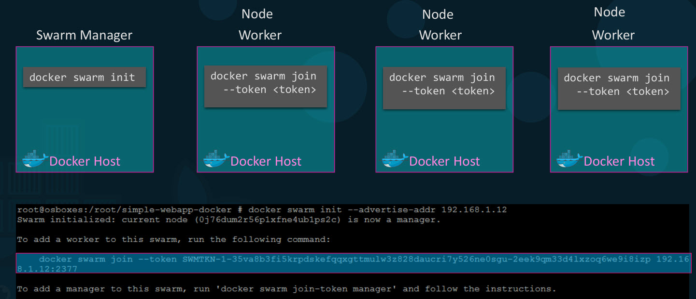
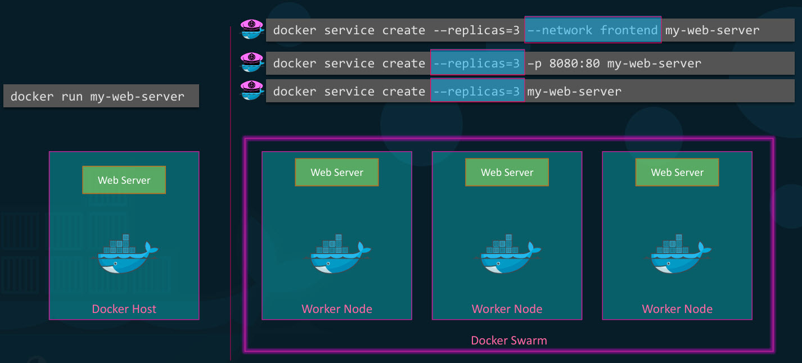

# Before Container Orchestration
Docker can run a single instance of the application with Docker run command, but that's just one instance of your application on one docker host.

- when the number of users increase and that instance is no longer able to handle the load, we deploy additional instance of our application by running the docker run command multiple times by ourselves.
- If a container fails we should be able to detect that and run the docker run command again to deploy another instance of that application.
- If the host crashes and is inaccessible, all containers hosted on that host become inaccessible too.
- we can build our own scripts which will help you tackle these issues to some extent.

# Container orchestration
- It is a solution to above problem where we have a set of tools and scripts that can help host containers in a production environment.
- It consists of multiple Docker hosts that can host containers. So even if one container fails, the application is still accessible through other containers.
- It allows us to deploy hundreds or thousands of instances of your application with a single command.
- This is a command used for Docker swarm **docker service create -–replicas=100 nodejs**
- some orchestration solutions can help to automatically scale up and scale down the number of instances when users increase and when the demand decreases, adds additotiones hosts to support user load.
- support: advanced networking between containers across different hosts, load balancing user requests across different hosts, shares storage between host, configuration management and security within cluster.
- Examples: Docker swarm (easy to setup and get started, lacks auto scaling features) coordinators from Google and MESOS (difficult to setup and get started, has advanced features) from Apache.

## Docker Swarn
- we could now combine multiple Docker machines together into a single cluster Docker swarm.
- It will distribute services or application instances into separate hosts for high availability and load balancing across different systems and hardware to set up a Docker swarm.
- If we have multiple hosts with Docker installed on them, then we must designate one host to be master/swarm manager and others as slaves/workers.
- Then run **docker swarm init** command which will initialize swarm manager. The output will also provide the command to be run on the worker nodes to join the manager.

- After joining the swarm, workers are referred as nodes, we create services and deploy them on swarm cluster.
- If we run docker run command, this creates a new container instance of application and serves on web server.
- To utilize cluster to run multiple instances of web server:
  - one way is to run the docker on each worker node, there could be hundreds of nodes and need to manually setup load balancing to monitor the state of each instance, if instances fail we have to restart them. This becomes impossible task.
  - the other way is Docker swarm orchestration which does all of this for us.

- The key component of swarm orchestration is the Docker services which are one or more instances of a single application or service that runs across the site.
- If we create a Docker service to run multiple instances of web server application across worker nodes in my swarm cluster. for this we run docker service create command on the manager node and specify image name there and use the option replicas to specify the number of instances we would like to run across the cluster.