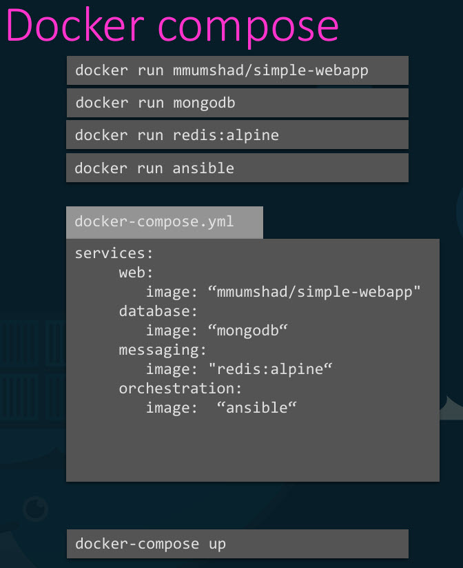
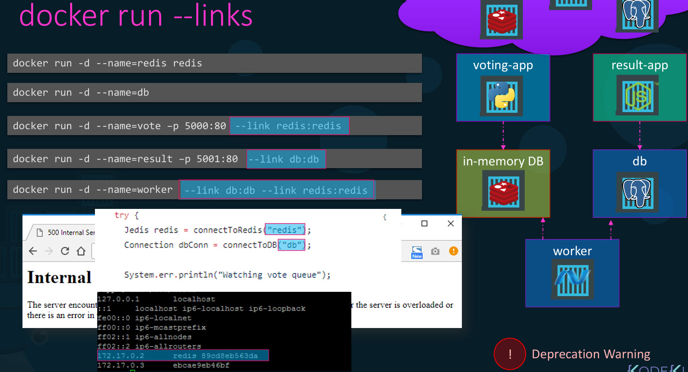
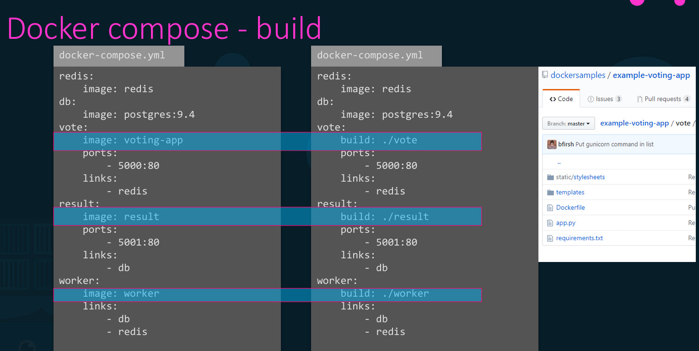
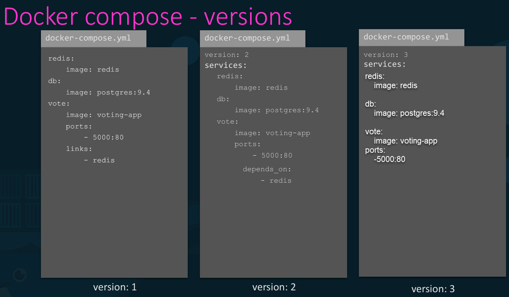
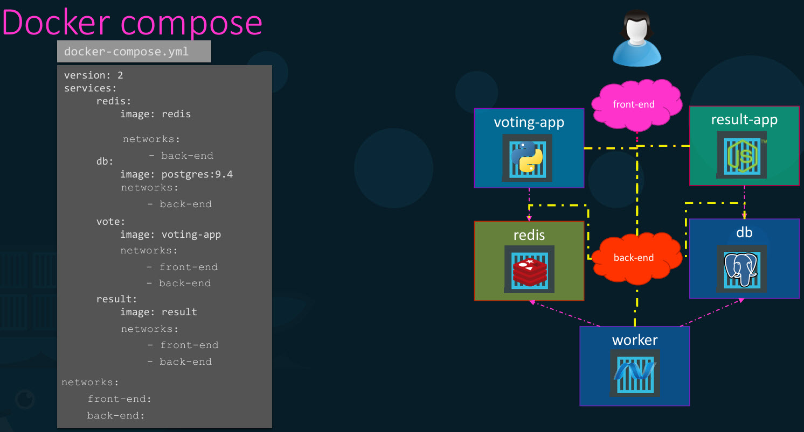

# Docker Compose



If we needed to set up a complex application running multiple services, a better way to do it is to use Docker Compose. We can create a configuration file in YAML format with different services and options. Then we run **docker compose up** to bring up the entire application stack. It is only applicable to running containers on a single Docker host.

## Voting System Application

This is a sample voting application which provides an interface for a user to vote and another interface to show the results.

### Components:  
- web application developed in Python to provide the user with an interface to choose between two options a cat and a dog.
- When you make a selection, the vote is stored in redis (in this case serves as a database in memory).
- This vote is then processed by the worker, which is an application written in dot net.
- Worker application takes the new vote and updates the persistent database, which is a PostgreSQL (In our case, it has a table with the number of votes for each category,Cats and dogs).
- The result of voting is displayed in a web interface, which is developed in Node.js.



- how we can put together this pplication stack on a single Docker engine using first Docker run commands and then Docker compose. Let us assume that all images of applications are already built and are available on Docker Repository.
- We successfully ran all different containers, but there seems to be some problem, it doesn't seem to work. The problem is that we have successfully run all the different containers, but we haven't actually linked them together.
- Link is a command line option to link containers together.



- If we like to instruct Docker Compose to run a Docker build instead of trying to pull an image, we could replace the image line with a build line and specify the location of a directory which contains the application code and a Docker file with instructions to build the Docker image.



- In version 1,  if we wanted to deploy containers on a different network other than the default bridge network, there was no way of specifying that in this version of the file.
- In version 2, we are specifying stack information in service section, it automatically creates a dedicated bridge network for this application and attaches all containers to that new network. All containers are able to communicate to each other using each other's service name. So don't need to use links. If voting web application is dependent on the redis service.we can add a **depends on** property to the voting application and indicate that it is dependent on redis.
- In version 3, similar to version 2.



- For example, we would like to separate the user generated traffic from the application's internal traffic.
- So we created a front end network dedicated for traffic from users and a back end network dedicated for traffic within the application.
- We then connected the user facing applications, which are the voting app and the result app to the front end network and all the components to an internal backend network.

- docker run -d --name redis redis:alpine
- docker run -d --name clickcounter --link redis:redis -p 8085:5000 kodekloud/click-counter  
`--link <source_container>:<alias>` : Connect the clickcounter container to the already-running redis container, and let clickcounter reach it using the hostname redis
```YAML
version: "2"
services:
  redis:
    image: redis:alpine
  clickcounter:
    image: kodekloud/click-counter
    ports:
      - 8085:5000
```