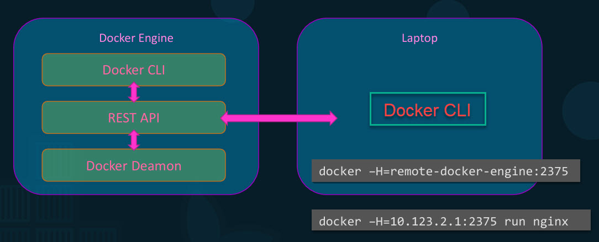
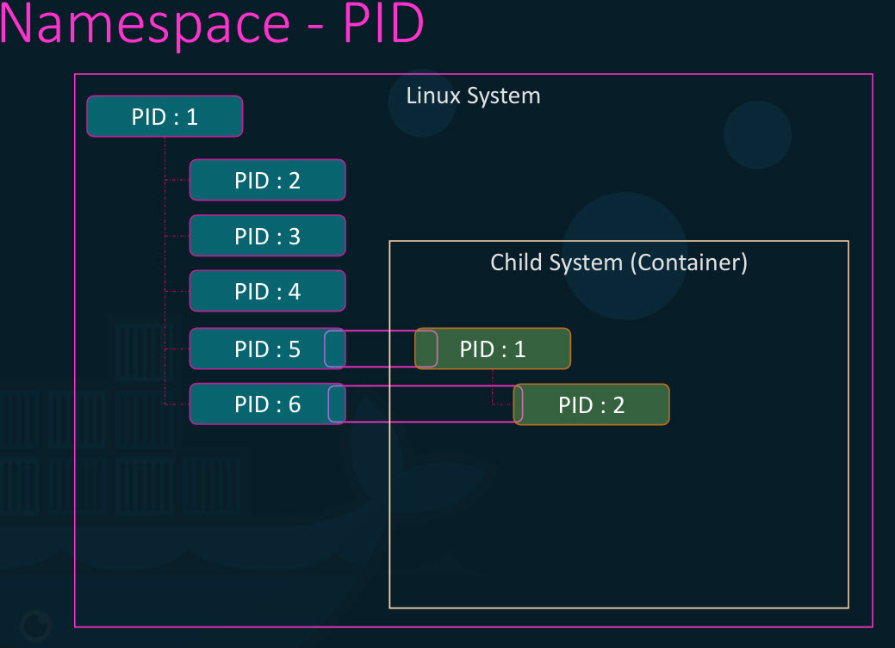
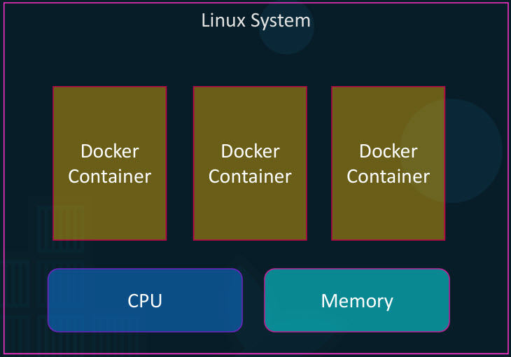

# Docker Engine

- Docker engine is referred to a host with Docker installed on it.
- Installing Docker on a linux host is actually installing three different components: 
 - Docker demon: a background process that manages Docker objects like images, containers, volumes, etc.
 - Docker rest API: API interface that programs can use to talk to demon and provide instructions, we can create own tools using this.
 - Docker CLI: command line interface that we've been using until now to perform actions such as running a container, stopping containers, destroying images etc. It uses rest API to interact with docker demon.

- Dockers CLI need not necessarily be on the same host, It could be on another system like a laptop and can still work with a remote Docker engine.
- We need to use the -H option on docker command and specify the remote Docker engine address and port.

## Containerization

Docker uses namespace like Process ID, Network, Mount, Unix Timesharing and Inter Proccess Communication to provide isolation between containers.

### Namespace

- Whenever a Linux system boots up it starts with just one process ID, which is root process and kicks off all the other processes in the system by the time the system puts up completely.
- These are unique and two processes cannot have the same process I.D.

- If we create a container like a child system within the current system, the child system needs to think that it is an independent system on its own and it has its own set of processes originating from a root process
with a process ID.
- The processes running inside the container are in fact processes running on the underlying host.
- As processes cannot have same process ID, using Namespace each process can have multiple process IDs associated with it.
- Here five and six get another process ID starting with PD 1 in the container namespace which is only visible inside the container, so the container thinks that it has its own root process tree and so it is an independent system.
- **docker exec containerID/name ps -eaf**: exec executes a command inside the docker container, ps lists all the proccesses running in it along with PID.
- **ps -eaf | grep docker-java-home**: when we run the same process in docker host, we could find a different process ID

### CGroup

- Docker host as well as the containers shared the same system resources such as CPU and memory.
- There is no restriction as to how much of a resource a container can use and hence a container may end up utilizing all of the resources on the underlying host.

- To restrict the amount of CPU/memory utilization Docker uses CGroups (control groups) to restrict the amount of hardware resources allocated to each container.
  - **docker run --cpus=.5 ubuntu**: container does not take up more than 50% of host CPU at any given time.
  - **docker run --memory=100m ubuntu**: container doesn't take up more than 100MB of host Memory