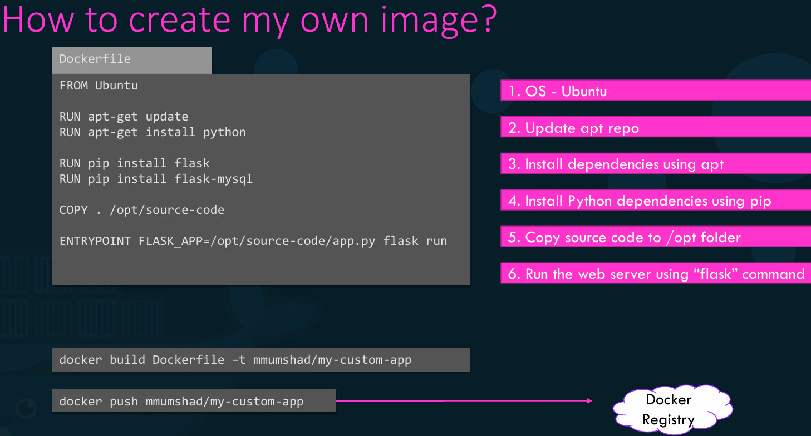
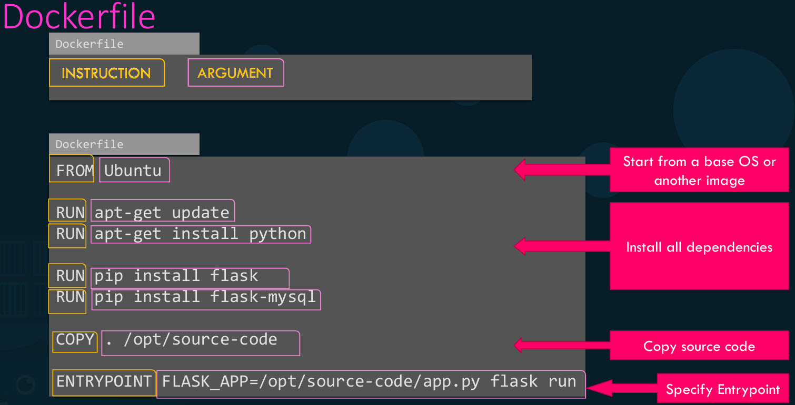
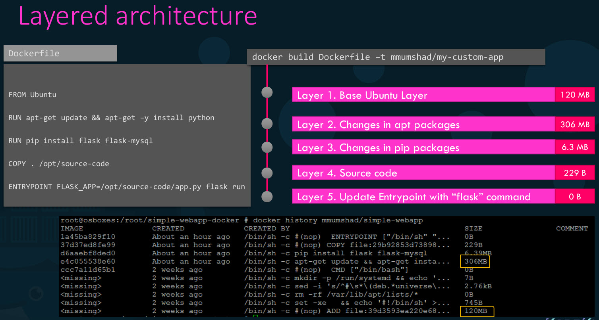
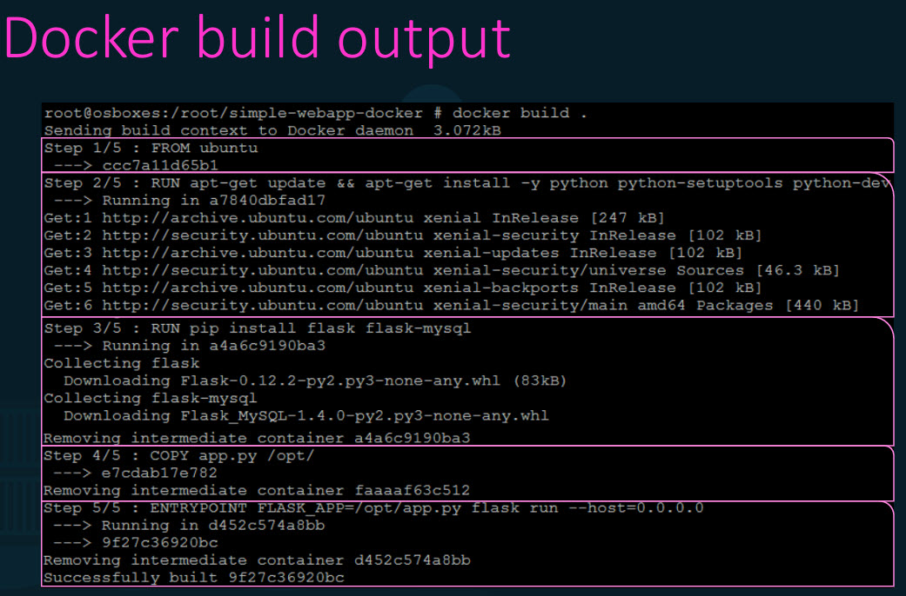
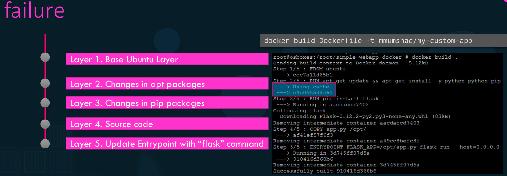
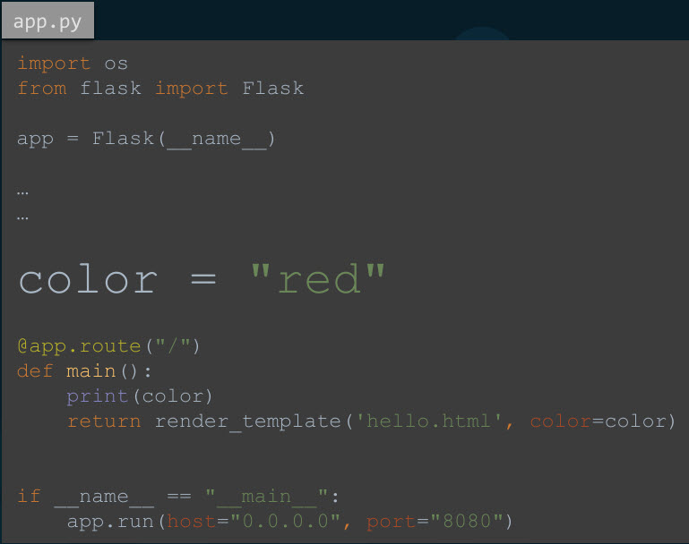
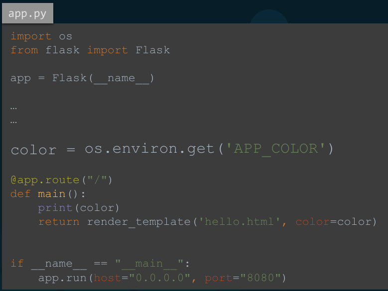
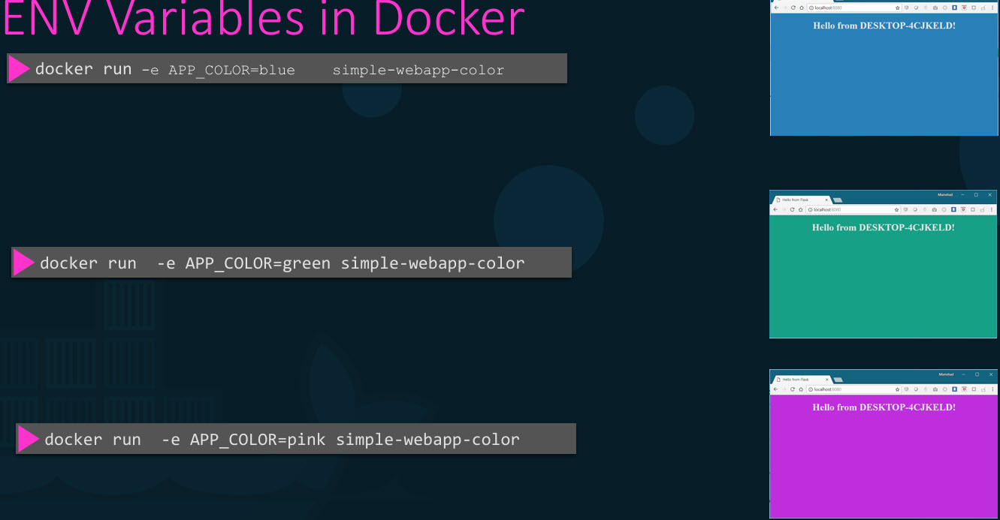

# creating an image for a Simple Web Application

- why would you need to create your own image?
  - Because we cannot find a component/service that we want to use as part of our application on Docker Hub already.
  - Or team decided that the application we're developing will be authorized for ease of shipping and deployment.
- we are going to containerised an application, a simple web application that was built using the Python Flask framework. And deploying the application manually.



- start with an OS like Ubuntu -> update source repositories using apt -> install dependencies using apt -> install python dependencies using pip -> copy over the source code of application to a location inside Docker image/OPPT -> run the web server using the flux command.
- Then create directory with some name like 'simple-webapp', go to 'simple-webapp' and paste all the code in a file like 'app.py'. Then create a Docker file named 'Docker File' and write down the instructions for setting up your application
in it as shown in image.
- Once done, build your image using the 'Docker build' command like **docker build . -t webapp**and specify the Docker file as input as well as a tag name for the image.
- This will create an image locally on your system to make it available on the Public Docker Hub Registry, Run the 'Docker Push' Command and specify the name of the image you just created.



- Docker file is a text file written in a specific format that Docker can understand.
- It's in an instruction and argument format.
- In this Docker file, everything on left in caps is an instruction in this case, from run, copy and entry point are all instructions. Each of these instruct Docker to perform a specific action while creating image.
- Everything on the right is an argument to those instructions.
- It's important to note that all Docker files must start with a from instruction.
- The run instruction instructs Docker to run a particular command on those base images.
- Entry Point allows us to specify a command that will be run when the image is run as a container.



- When Docker builds the images, it builds these in a layered architecture.
- Each line of instruction creates a new layer in Docker image with just changes from the previous layer.
- For example, first layer is a base ubuntu OS -> second layer installs all the APC packages -> third layer with python packages -> fourth layer copies source code over -> final layer updates entry point of the image.
- Since each layer only stores the changes from the previous layer, it is reflected in the size as well.



- When we run the Docker build command, you can see the various steps involved and the result of each task.
- All layers built are cached by Docker, so layered architecture helps you restart Docker build from that particular step in case it fails and reuse the previous layers from cache and continue to build the remaining layers. Or if you were to add new steps in build process, you wouldn't have to start all over again.



- This way rebuilding your image is faster and you don't have to wait for Docker to rebuild the entire image each time. Helpful when updating source code as it may change more frequently. 
- To reduce the size of the images we can use **FROM python:3.12-alpine** instead of **FROM python:3.12**, combining RUN Commands like  
```dockerfile
RUN apt update && \
    apt install -y curl && \
    rm -rf /var/lib/apt/lists/*
```

## Environment variables



- The code shown in image is used to create a web application that displays a web page with a background color. In the code the color is set to "red"
- If we decide to change the color we'll have to change the application code.



- But it is a best practice to move such information out of code and into an environment variable called APP_COLOR and set thar variable with a desired value.
- We use docker run commands with '-e' option to set an environment variable within the container to deploy multiple containers with different colors.



- To find the environment variable set on a container that's already running, use **docker inspect imagename** command to inspect the properties of a running container under the config section, you will find the list of environment variables set on the container.

- When I ran **docker run mysql**
2026-01-18 16:49:15+00:00 [Note] [Entrypoint]: Entrypoint script for MySQL Server 9.5.0-1.el9 started.   2026-01-18 16:49:16+00:00 [Note] [Entrypoint]: Switching to dedicated user 'mysql' 2026-01-18 16:49:16+00:00   [Note] [Entrypoint]: Entrypoint script for MySQL Server 9.5.0-1.el9 started. 2026-01-18 16:49:16+00:00 [ERROR]  
[Entrypoint]: Database is uninitialized and password option is not specified You need to specify one of the  following as an environment variable:
 - MYSQL_ROOT_PASSWORD  
 - MYSQL_ALLOW_EMPTY_PASSWORD 
 - MYSQL_RANDOM_ROOT_PASSWORD
- we need to run **docker run -d -e MYSQL_ROOT_PASSWORD=db_pass123 --name mysql-db mysql**, which deploys a mysql database using the mysql image and named it mysql-db. Also sets the database password to db_pass123. Lookup the mysql image on Docker Hub and identify the correct environment variable to use for setting the root password. To know the env field from within a mysql-db container, run docker exec -it mysql-db env
