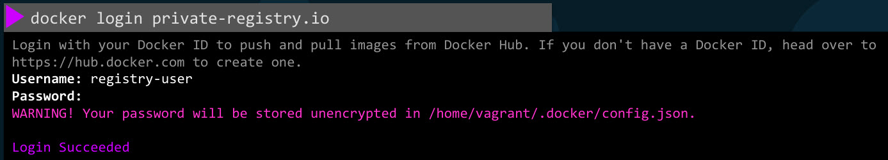

# Docker Registry

Docker Registry stores Docker images, It's a central repository of all Docker images. Whenever we create a new image or update an existing image, we push it to registry and every time anyone deploys this application, it is pulled from that registry. There are many other popular registries as well, example: Google's registry is at Gcr.io these are publicly accessible images.

- For examples: **docker run nginx** runs an instance of the nginx image.
- Let's take a closer look at that image name.  
**image: docker.io/library/nginx**
  - image name is nginx (image/repository)
  - nginx is pulled from library (User Name/Docker Hub Account Name/Organization Name)
    The library prefix is used when no specific account or repository is provided, indicating an official Docker Hub image. If we create our own account and create our own repo or images under it we can specify it's name.
  - docker.io is default Docker's registry, as we didn't specified the location where these images are to be   pulled from, it is assumed to be on Docker's default registry. Docker hub DNS name for which is Docker.io.

## Private Registry

- When we have applications built in-house that shouldn't be made available to the public.
- Them hosting an internal private registry may be a good solution. Many cloud service providers such as AWS, Azure, or GCP, provide a private registry by default.
- To run a container using an image from a private registry, you first log in to your private registry using the Docker login command and nput your credentials. If we don't login, it says the image cannot be found.
- So remember to always log in before pulling or pushing to a private registry.

- Then run the application using private registry as part of the image name.
**docker run private-registry.io/apps/internal-app**

### How do we deploy our own private registry within our organization?

- The Docker registry is itself another application, it's available as a Docker image. The name of the image is 'registry' and it exposes the API on port 5000.
- To push our image to it
  - **docker run -d -p 5000:5000 --name registry registry:2**
  - **docker image tag my-image localhost:5000/my-image** : tag the image with the private registry URL in it, here it's running on the same docker host, I can use localhost semi colon 5000 and image name.
  - **docker push localhost:5000/my-image**
  - **docker pull localhost:5000/my-image**
  - **docker pull 192.168.56.100:5000/my-image**
- From now on, we can push and pull my image from anywhere within this network using either localhost if you're on the same host, or the IP or domain name of my docker host, if I'm accessing from another host in my environment.

## Example

- **docker run --name my-registry --restart always -p 5000:5000 registry:2**  
--restart always : “If this container stops for ANY reason, automatically start it again.
- **docker pull nginx:latest**   
- **docker pull httpd:latest**
-  **docker push nginx**  
Using default tag: latest  
The push refers to repository [docker.io/library/nginx]  
d9d3f8c27ad7: Layer already exists  
e50a58335e13: Layer already exists    
errors:  
denied: requested access to the resource is denied    
unauthorized: authentication required    
- **docker push localhost:5000/nginx:latest**
The push refers to repository [localhost:5000/nginx]
An image does not exist locally with the tag: localhost:5000/nginx
- **docker image tag nginx:latest localhost:5000/nginx**
- **docker image tag httpd:latest localhost:5000/httpd**
- **docker push localhost:5000/nginx:latest**          
The push refers to repository [localhost:5000/nginx]
Get "http://localhost:5000/v2/": dial tcp [::1]:5000: connect: connection refused
- **docker ps -a**   
CONTAINER ID  IMAGE       COMMAND                CREATED          STATUS                      PORTS      NAMES  
fdeda0032d06  registry:2  "/entrypoint.sh /etc…" 23 minutes ago   Exited (2) 23 minutes ago             my-registry
- **docker start my-registry**  
my-registry
- **docker push localhost:5000/nginx:latest**
The push refers to repository [localhost:5000/nginx]
d9d3f8c27ad7: Pushed 
4b53e01dba29: Pushed 
3b4fce0e490d: Pushed 
4c34f6878173: Pushed 
547c913b4108: Pushed 
e84c0e25063e: Pushed 
e50a58335e13: Pushed 
latest: digest: sha256:a6dd519f4cc2f69a8f049f35b56aec2e30b7ddfedee12976c9e289c07b421804 size: 1778
- **docker push localhost:5000/httpd:latest**          
- **curl -X GET localhost:5000/v2/_catalog**  
{"repositories":["httpd","nginx"]}
- docker ps                              
CONTAINER ID   IMAGE        COMMAND                  CREATED          STATUS         PORTS                                       NAMES
fdeda0032d06   registry:2   "/entrypoint.sh /etc…"   26 minutes ago   Up 2 minutes   0.0.0.0:5000->5000/tcp, :::5000->5000/tcp   my-registry
- **docker image prune -a**
WARNING! This will remove all images without at least one container associated to them.
Are you sure you want to continue? [y/N] y
Deleted Images:
untagged: nginx:latest
deleted: sha256:827b99c091a57f0fc1ad0a026084fa9335638ba911267b9764a05b991077a0da
Total reclaimed space: 1.994GB
- **docker images**        
REPOSITORY   TAG       IMAGE ID       CREATED       SIZE
registry     2         26b2eb03618e   2 years ago   25.4MB
- **docker pull localhost:5000/nginx:latest**

