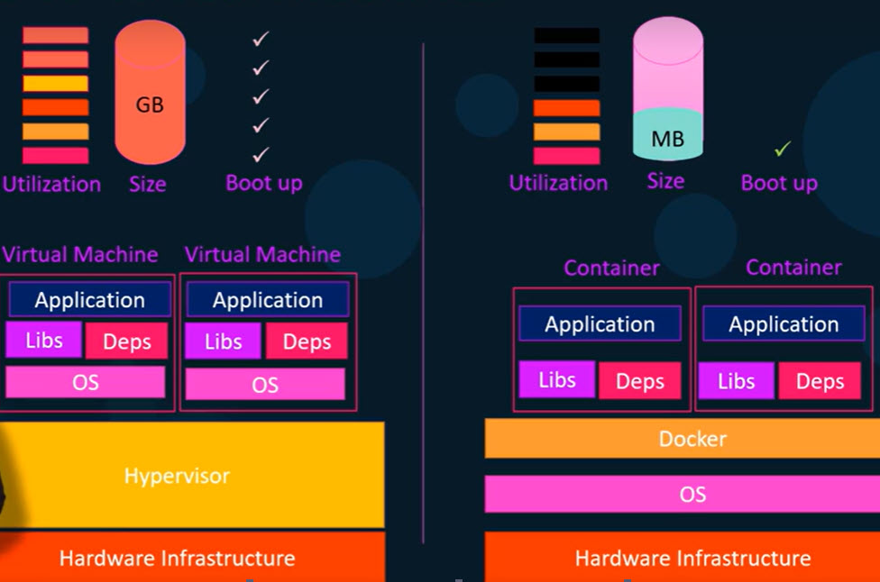
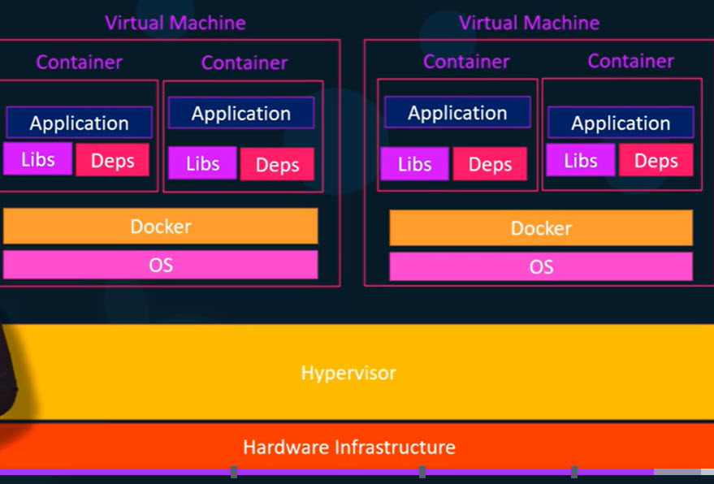

# Docker

- Docker is a containerization or OS‑level virtualization platform that enables you to create, deploy, and run applications conveniently with the help of containers.
- This is used to package your application and all its dependencies together in the form of containers to make sure that your application works seamlessly in any environment which can be developed or tested or in production.
- Written in the Go programming language.
- we just need Docker to be installed on our systems and build the docker configuration. Then developers could get started with a simple Docker run command, irrespective of what the underlying OS they run.

## Containers

- A Container is a lightweight, standalone/Isolated (can have their own processes/services, network interfaces amd mounts) package that include everything an application needs to run (code, runtime, configuration files, all required libraries, dependencies, settings).
- This ensures the application behaves the same way whether on a developer’s laptop, testing environment, or production server.
- Unlike traditional virtual machines that carry a full OS, containers only pack what is required, making them faster and more efficient.
- Containers have existed for about 10 years now and some of the different types of containers are LXC, LXD, LXCFS etc. Docker utilizes LXC containers.
- setting up  container environments is hard as they are very low level. That is where Docker offers a high level tool with several functionalities making it easy for end users like us.

### Dockerizatoion/containerization vs Virtualization

#### Virtualization
Running multiple virtual machines (VMs) on one physical computer. Each VM: has its own OS, thinks it has its own hardware and is fully isolated.

- One physical server running:  
VM1 → Linux + Apache  
VM2 → Linux + MySQL  
VM3 → Windows + IIS  
Each VM boots like a real computer.
- Pros: Strong isolation, Can run different OSes, Secure
- Cons: Heavy (each VM has an OS), Slow startup, High memory usage

#### Dockerization (containers)
Running applications in containers that share the same OS kernel. Containers: Do NOT have a full OS, Only contain the app + dependencies, Are lightweight and fast.
- Example: One Linux server running  
Container 1 → Nginx  
Container 2 → MySQL  
Container 3 → Python app  
- Pros: Very fast startup (seconds), Uses less memory, Easy to move between systems, “Works on my machine” problem solved
- Cons: Weaker isolation than VMs, Same OS kernel only

- Now when you have large environments with thousands of applications, containers running on thousands of docker hosts, you will often see containers provisioned on virtual docker hosts.
- We can use the benefits of virtualization to easily provision or decommission docker hosts as required.

- At the same time make use of Docker to easily provision applications and quickly scale them as required.
- In this case we will not be provisioning many VMs as we used to provision VM for each application. Now we may provision a VM for hundreds or thousands of containers.

### Container vs Image

| Feature                | Image                           | Container                   |
| ---------------------- | --------------------------------|--------------------------- |
| State                  | Static                          | Running instances of images |
| Read/Write             | Read-only                       | Read + Write                |
| Purpose                | Template like VM                | Execution                   |
| Exists Without Running | Yes                             | No                          |
| Multiple Instances     | One image - 1 or many containers| Each is separate            |
| Changes Persist        | No                              | Only while container exists |

## Before Docker

1. Physical servers (oldest method)
- How it worked: One app per server, One OS per server
- Example: considering container and ship example (Goods packed in boxes, barrels, bags and eery ship handled cargo differently)
Server 1 → App 1  
Server 2 → App 2  
- Problems: Very expensive, Wasted resources, Slow scaling, Apps installed manually, Different dependencies, “Works on my machine” and Hard deployments

2. Virtual Machines (pre-Docker era)
- Improvement: Multiple apps via multiple VMs on one server
- Still problems: Heavy, Slow provisioning, OS duplication, takes more space
- example of container and ship (Ship is divided into fully separate rooms, Each room is like a small ship, Heavy but isolated)

3. Configuration management (before containers)
- Apps were installed directly on servers using: Shell scripts, Ansible, Puppet, Chef
- Example: 'yum install nginx', 'pip install flask'
- Problems: Dependency conflicts, Hard to reproduce, “It works on my server”

4. Early container ideas (Docker’s ancestors)
- Before Docker, we had: chroot, FreeBSD Jails, Solaris Zones, LXC (Linux Containers)
- They existed, but were: Hard to use, Not standardized, Not developer-friendly
- Docker made containers easy and popular
- Example of container and ship (Cargo packed in standard containers, Same size, same handling, Easy to move between ships)

## One mental picture (remember forever)
- Physical Server  →  One house
- Virtual Machine  →  Multiple houses
- Docker Container →  Apartments in one building

- Suppose there are three developers in a team working on a single project.
- Meanwhile, each one of them has a Windows, Linux and MacOS.
- As they are using different environments for creating a single application, they are required to carry on
specific libraries, versions, Specific runtime (Java, Python, Node, etc.), files for their system, Environment variables and system settings.
- On an organizational/larger level deploying applications across different environments was often difficult, dependencies, configs, and OS variations caused “works here but not there” headaches.

## Advantages

Standardizes the runtime environment by bundling everything (app + dependencies) into containers.

- Portability: Build once and runs anywhere in local machine, Windows, macOS, Linux, cloud, on‑prem servers. And there is no need of environment rewrite.
- Consistency: Containers guarantees that an application can run the same way on any environment(Developmet, Stages, Testing, Production), eliminating "it works on my machine" problem.
- Isolation: Docker containers isolate applications from each other and from the host system allowing multiple applications to run securely on a single host without interfering with one another.
- Lightweight: allows applications to share the host OS kernel instead of running a separate guest OS like in traditional virtualization.
- Scalability: Docker makes it easy to scale services up or down as needed. Container orchestration platforms like Kubernetes or Docker Swarm can automatically manage, scale, and orchestrate containers across a cluster of machines
- Efficiency and Resource Optimization: As it shares Host OS kernel, they start up quickly, use fewer resources, and allow more containers to run on the same hardware.
- Simplified Management: Docker provides a simple command-line interface (CLI) and a clear, image-based system for tracking dependencies, manage different versions of an application, and roll back updates if necessary.
- Faster Development Cycles: Docker streamlines the build, test, and deployment process. Developers can quickly set up complex development environments, collaborate easily by sharing container images, and deploy applications rapidly across various environments.
- Easy Setup: New developers can start instantly, Faster onboarding, No complex setup.