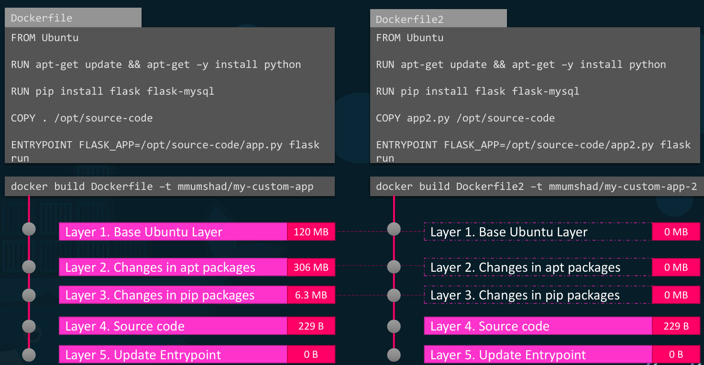
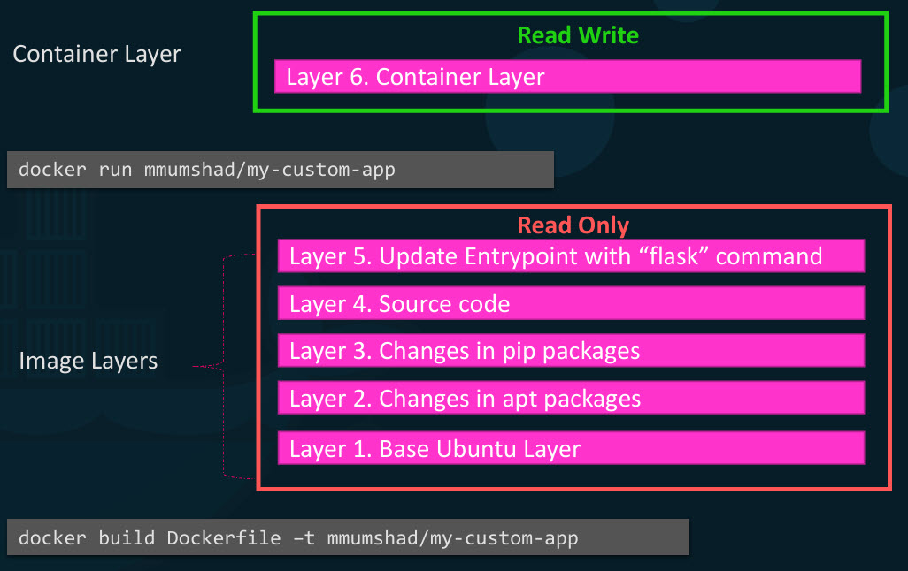
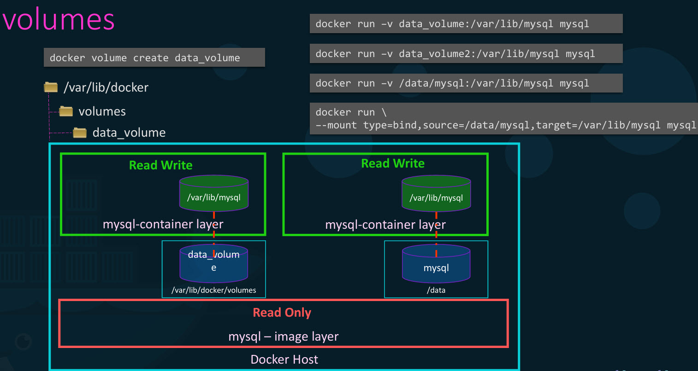

# Docker Storage

- Docker stores data on local file system, when you install Docker on a system it creates this folder at **var/lib/docker** we'll have multiple folders under it called aufs, containers, image, volumes etc..

## Dockers layered architecture.

- Each line of instruction in the docker file creates a new layer in the Docker image with just the changes from the previous layer.

- Let's consider a second application which has a different docker file but is similar to our first application, but uses a different source code and entry point to create a different application.
- When we run docker build command to build image, it reuses the first three layers it built for the first application from the cache and only creates last two layers so building images will becomw faster and saves disk space.
- This is also applicable if we update application code.

## Read Write Layer 

- let's rearrange the layers bottom up, all of these layers are created when we run the docker build command to form Docker image layers.
- We cannot modify contents of these layers as they are read only, we can only modify them by initiating a new build, which creates writable layer on top of the image layer, it stores data created by container such as log files by applications.
- The life of this layer though is only as long as the container is alive.

- Same image layer is shared by all containers created using this image, if we were to log into newly created container and say create a new file called temp.txt. It would create that file in container layer which is read and write.
- We can modify this file but before saving the modified file, Docker automatically creates a copy of the file in the read write layer and we'll be modifying a different version of file in the read write layer.
- All future modifications will be done on this copy of the file in the read write layer, this is called copy on write mechanism the image layer being read only.
- These files in image will remain same all the time until you rebuild image using the docker build command.

## volume

-  If we would like to preserve the data created by container add a persistent volume, but first create a volume using docker volume create command.

- **docker volume create data_volume**
- **docker run –v data_volume:/var/lib/mysql mysql**: creates a folder called data_volume under the var/lib/docker/volumes directory.
- **docker run \–-mount type=bind,source=/data/mysql,target=/var/lib/mysql mysql** create a new container and mount the data volume we created into var/lib/mysql folder inside the container, so all data written by the database is in fact stored on volume created on the docker host.
- **docker run –v data_volume2:/var/lib/mysql mysql** if we didn't run volume create for data_volume2, it creates that volume before the docker run command.  
- We'll see all these volumes if you list the contents of the var/lib/docker/volumes folder, this is called volume mounting, we use command Docker run -v
- If we have some external storage on docker host at /data and we would like to store database data on that volume not in var/lib/docker/volumes folder. In this case we will provide complete part of folder that we would like to mount, which is called as bind mounting.  
ex: **docker run \–-mount type=bind,source=/data/mysql,target=/var/lib/mysql mysql**
- So there are two types of mounts a volume mounting and a bind mount
  - volume mount mounts a volume from the volumes directory
  - bind mount mounts a directory from any location on the docker host.
- '-V' is an old style the new way is to use '--mount' option which is more verbose and uses source (location on container) and target (location on host) options, we specify each parameter in key equals value format.

## Storage Drivers

- **storage drivers** are responsible for maintaining the layered architecture, creating a writable layer,  moving files across layers. Some common storage drivers are AUFS, BTRFS, ZFS, device-mapper, overlay and overlay 2.
- Selection of the storage driver depends on the underlying OS being , for example with Ubuntu default storage driver is a 'ufs', but ufs is not available on other OS like fedora or cent OS.
- Docker will choose the best storage driver available automatically based on OS, different storage drivers also provide different performance, stability, characteristics. so we'll choose one that fits the needs of our application and organisation.

## Practice

- **docker info**: lists info about the docker installed in particular systems, for debian and ubuntu default storage driver is aufs, stored in folder **/var/lib/docker/aufs** inside it we'll have 3 folders:
  - diff/ : contents of each layer or folder is stored in separate subdirectory
  - layers/ : stores metadata about how image layers are stacked
  - mnt/: stores information about mount points
- when we pull some image like **docker pull hello-world** to know how it was built, we can check it in **docker history imageID/imagename**.
- we can see the output of hello-world image by listing it's path like **ls /var/lib/docker/aufs/diff/imageID**
- To see the actualy space consumption on Disk use command **docker system df**
- **docker system df -v** we can see space break downed by each image, we'll see shared and unique size, when we add all the unique sizes, that size would match the size given from **docker system df**
- **sh get-data.sh** prints the output present in get-data.sh
- **docker run --name mysql-db -d -e MYSQL_ROOT_PASSWORD=db_pass123 -v /opt/data:/var/lib/mysql mysql** runs a container using image mysql, names it mysql-db, runs it in detached mode, assigns it a password, and preserves the data which was in /opt/data to /var/lib/mysql