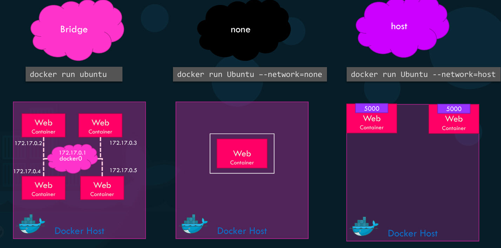
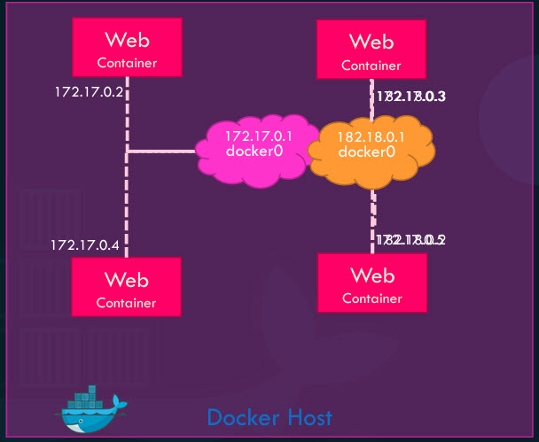
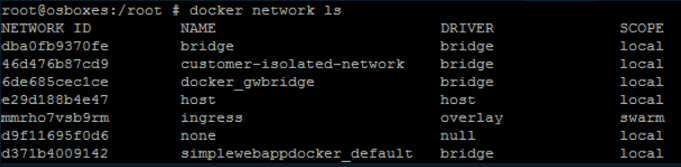
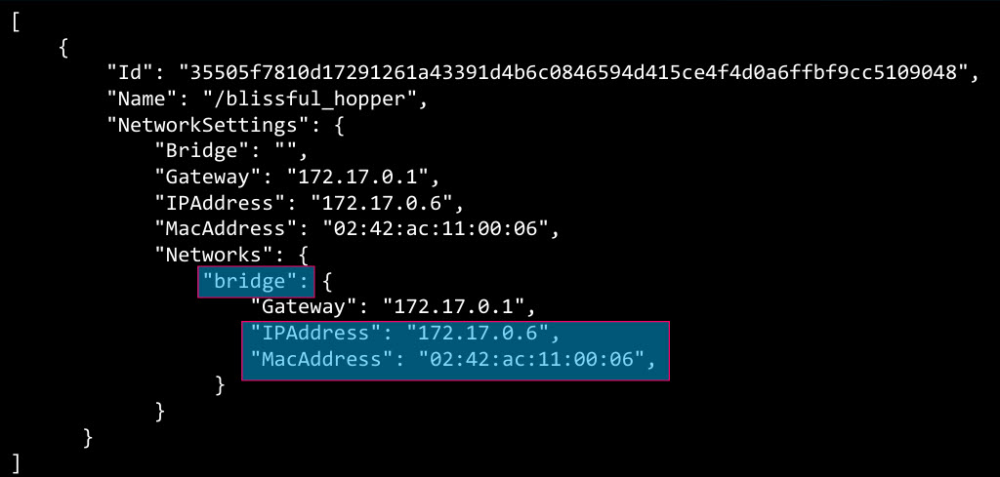

# Network

- When we install Docker it creates three networks automatically 'bridge', 'none' and 'host'.
- **bridge** is the default network a container gets attached to, and gets an Internal IP address usually in range 172.17 series. And it is a private network created by Docker on the host.
- If you would like to associate the container with any other network we specify the network information using the network command line parameter like **--network=none**.

- containers can access each other using this internal IP, to access these containers from the outside world, map the ports of these containers to ports on the docker host. Another way to access containers externally is to associate container to the host network.
- we will now not be able to run multiple web containers on same host on same port as the ports are now common to all containers in the host network with none network.

## User Defined Network

- If we wish to isolate the containers within the docker host, for example first two web containers on internal network 172 and second two containers on a different internal network like 182, by default Docker only creates one internal bridge network.
- We could create our own internal network using command  
**docker network create –-driver bridge -–subnet 182.18.0.0/16 custom-isolated-network**  
**docker network ls**  
  
- To see network settings, IP address assigned to an existing container run **docker inspect containerID/name**  

- containers are isolated within the host Docker users Network Name spaces, that creates a separate namespace for each container. It then uses virtual Ethernet pairs to connect containers together.

## Practice

- docker run -d --name alpine-2 --network=none alpine
- Create a new network named wp-mysql-network using the bridge driver. Allocate subnet (defines the IP address range for a Docker network) 182.18.0.0/24. Configure Gateway 182.18.0.1  
**docker network create --driver bridge --subnet 182.18.0.0/24 --gateway 182.18.0.1 wp-mysql-network**
- Deploy a mysql database using the mysql:5.7 image and name it mysql-db. Attach it to the newly created network wp-mysql-network, Set the database password to use db_pass123. The environment variable to set is MYSQL_ROOT_PASSWORD   
**docker run -d -e MYSQL_ROOT_PASSWORD=db_pass123 --name mysql-db --network wp-mysql-network mysql:5.7**
- Deploy a web application named webapp using the kodekloud/simple-webapp-mysql image. Expose the container’s port 8080 to port 38080 on the host.

The application makes use of two environment variable:  
1: DB_Host with the value mysql-db.  
2: DB_Password with the value db_pass123.  
Make sure to attach it to the newly created network called wp-mysql-network.  

Also make sure to link the MySQL and the webapp container.

**docker run --network=wp-mysql-network -e DB_Host=mysql-db -e DB_Password=db_pass123 -p 38080:8080 --name webapp --link mysql-db:mysql-db -d kodekloud/simple-webapp-mysql**