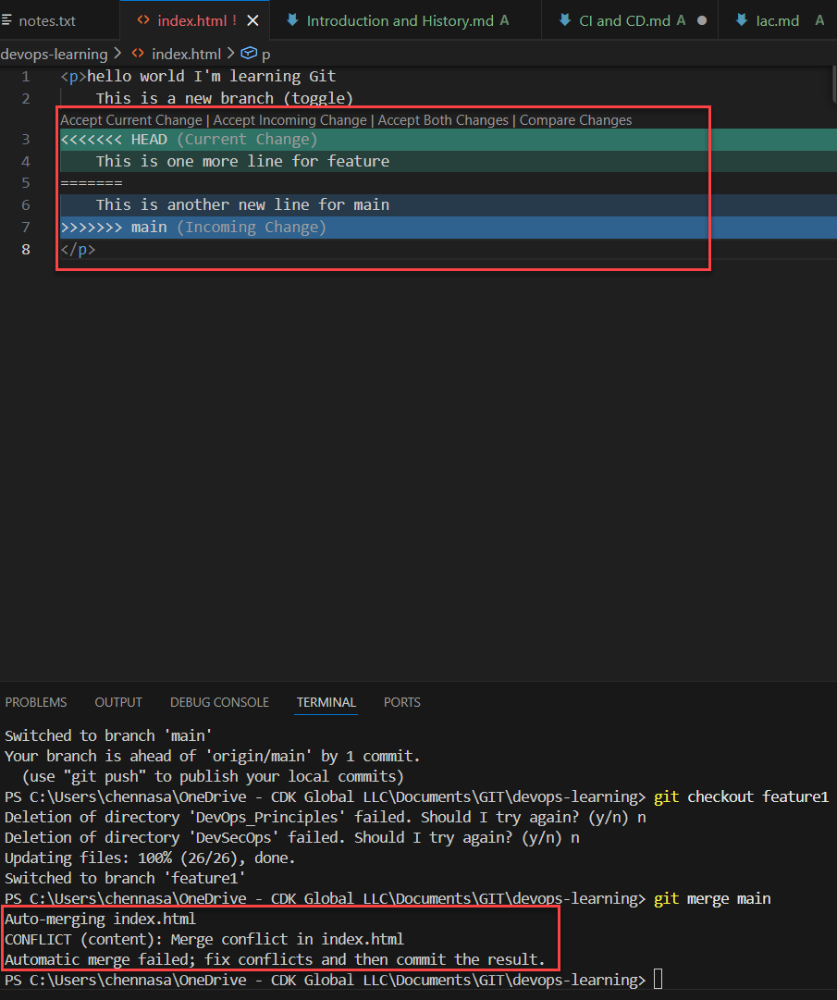
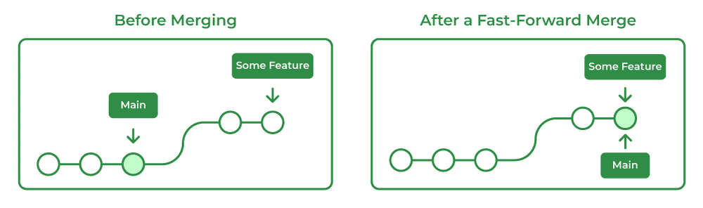
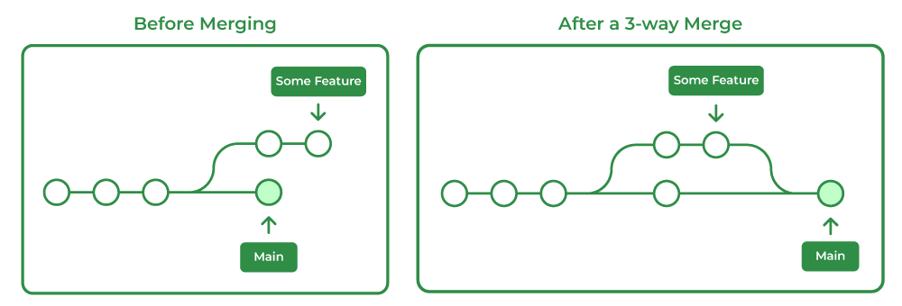
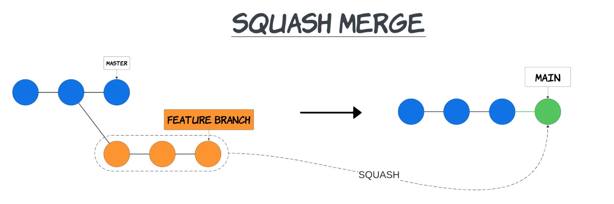
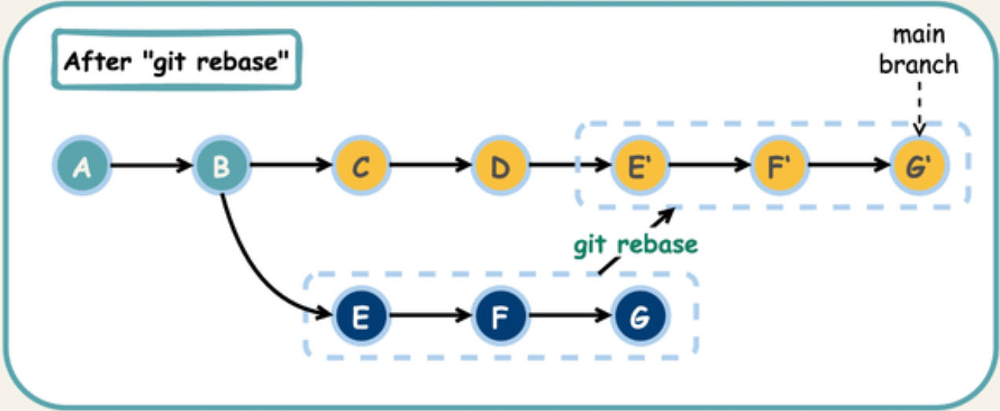
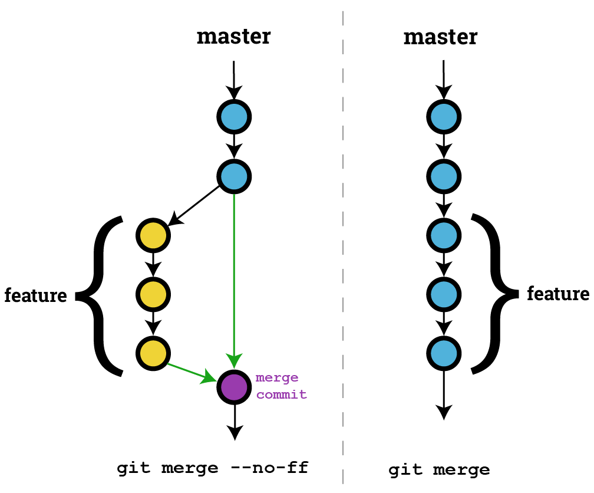

# Merging

- Merging integrates changes from one branch into another.
- This process combines the commit histories of two branches, allowing you to incorporate completed work from a feature branch back into the main codebase (e.g., main or master).

## Two ways of merging

### way1

We can use this if we want to merge from Local machine

- git diff `<branch name>` (to compare commits, branches, files and more)
- git merge `<branch name>` (to merge two branches)

### way2

Get a **PR (Pull Request)**. PR lets you tell others about changes we have pushed to a branch in a GitHub repo. A senior developer can know the changes made and to tell whether those changes could be merged to main branch or not.  

## Merge Conflicts

If both branches have made changes to the same lines of code in the same file, Git cannot automatically decide which changes to keep.  
This results in a **merge conflict**, which must be resolved manually by:

1. Editing the conflicted files  
2. Choosing which changes to keep  
3. Staging the resolved files  
4. Committing the merge resolution  



### Resolving Merge conflicts

AN event that takes place when Git is unable to automatically resolve differences in code between two commits.

#### Example

**Index.html (of main branch)**
- Create index.html file in main branch, then add and commit the changes.
```html
<p> This is a new feature (button) </p>
```
`git commit -am "made changes to main"`

**Index.html (of feature branch)**

- Create index.html file in main branch, then add and commit the changes.
```html
<p> This is a new feature (dropdown) </p>
```
`git commit -am "made changes to feature"`

- Then give `git diff main` to know differences between two branches
- And give `git merge main`, it'll throw merge conflict
- In merge conflict we''ll have three options

1. Accept Current Change  
If we want only to keep the currnet branche (ex: feature) changes.

2. Accept Incoming Change  
If we want to keep the changes made in other branch (ex: main)

3. Accept Both Chnages  
If we want to keep chnages made in both the branches.

**Index.html (of feature branch)**

```html
<p> This is a new feature (dropdown) </p>
<p> This is a new feature (button) </p>
```
- Save the changes in the files add and commit it.
- go to main branch and give `git merge feature`
- it resolves the merge conflicts

---

## Types of Merges

### 1. Fast-Forward Merge
- Occurs when the target branch has **not diverged** from the source branch.  
- No new commits were added to the target branch after the source branch was created.  
- Git simply **moves the target branch pointer** to the latest commit of the source branch.  
- Results in a **linear history**.



#### Example
```bash
git checkout main
git merge feature-branch
```

### 2. Three-Way Merge (Recursive Merge)
- Occurs when **both branches have unique commits (diverged)** since their common ancestor.  
- Git combines the changes and creates a **new merge commit**.  
- The history becomes **non-linear** because of the additional merge commit.
- Git creates a merge commit to combine histories.
- Uses three commits:
    1. The two branch tips
    2. Their common ancestor



#### Example
```bash
git merge feature-branch
```

### 3. Squash Merge
- Combines all commits from a branch into one single commit.
- Useful for maintaining a clean commit history.
- Does not automatically delete the branch.



#### Example
```bash
git merge --squash feature-branch
git commit
```

### 4. Rebase and Merge
- Rebase = rewrite history by moving or modifying commits
- Replays the commits of a branch on top of another branch.
- Produces a linear commit history.
- Does not create a merge commit.



#### Example
1. to fix the secret
- if we made 4 commits, let us assume out of those 3rd one is a bad commit which has some secret in it which be pushed to git. Then we can give the following commands:
```bash
git rebase -i HEAD~N # Lets you edit last N commits
# In our case it was 3rd commit so we are giving up to 4 commits
git rebase -i HEAD~4  # then an editor opens, then we need to change the 3rd commit or by it's hash from 'pick' to 'edit 3/hash' and Open the last 4 commits in interactive mode so I can edit/rewrite them
git rebase -i hash~1
# this will bring back before that bad commit, then we'll make the necessary changes to remove the bad commit
git add .
git commit --ammend
git rebase --continue
git push --force-with-lease
```
2. Delete a bad commit completely
```bash
git rebase -i HEAD~3
# then editor mode opens, we'll replace that particular bad commit from 'pick' to 'drop' which will delete that bad commit
```
3. Combine commits (clean history) A → (B + C combined)
```bash 
git rebase -i HEAD~2 #pick B - squash C
```
4. Change commit message
```bash
git rebase -i HEAD~1 # pick → reword
```
5. Move commits to another branch
Moves your commits on top of latest main
```bash
git checkout feature
git rebase main
```

**common commands**
```bash
git status              # see what's happening
git rebase --continue   # after fixing
git rebase --abort      # cancel everything, it may ask for option (y/n), we can type y
rm -rf .git/rebase-merge # Manually remove the rebase state or use this for power shell 'Remove-Item -Recurse -Force .git\rebase-merge'
git rebase --skip       # skip current commit
git commit --amend      # modify commit
git reflog              # recovery latest commit made after the bad commit, give that command and Look for the commit before you did the reset (your lost work).
git reset --hard <hash> # recovery the has of the commit that we found in the above command
git branch backup-save <that-commit-hash> # creates a backup so that we won't loose the work that we have done
git branch backup-safe  # creates a permanent backup
```

### 5. No-FF (No Fast-Forward) Merge
- Forces Git to always create a merge commit, even if a fast-forward is possible.
- Preserves branch structure.



#### Example
```bash
git merge --no-ff feature-branch
```

## rebase vs merge

| Use rebase     | Use merge          |
| -------------- | ------------------ |
| clean history  | preserve history   |
| fix commits    | team collaboration |
| before pushing | shared branches    |
