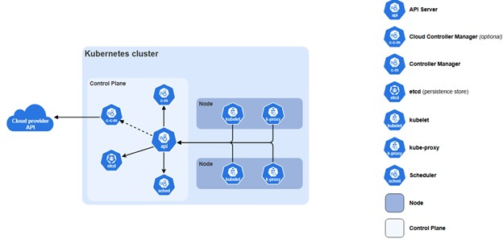
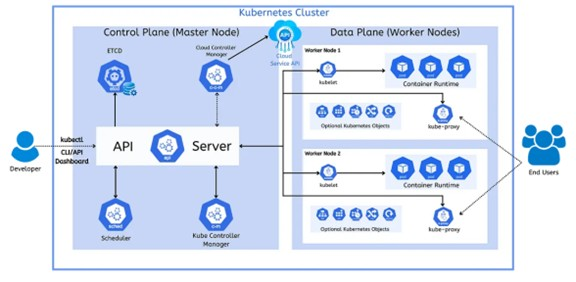

# Kubernetes
- Kubernetes, also known as K8's, was built by Google based on their experience running containers in production.
- It is now an open-source project (supported by all cloud service providers like GCP, Azure, AWS) and is one of the **popular Container Orchestration Technologies that manages and deploys thousands of containers in a cluster**.
- **Container Orchestration**: If our application relies on other containers, and to scale up and down the resources. We need a platform with set of resources, which could orchestrate the connection between containers and automatically scale up or down based on the load. The process of automatically deploying and managing containers is called Container Orchestration.
- We have Container Orchestration tools like Docker Swarn (from Docker, easy to set up and start, but lacks some advanced features), Kubernetes (from Google, difficult to set up and get started, but has options to customize deployments of complex architectures) and MESOS from Apache.

## Kubernetes Components
When we install Kubernetes on a system, we install the following components an API server, etcd service, a Kubernetes service, a container, runtime controllers and schedulers.

Control Plane (Master Node) components, which manages the cluster are:

- **API Server**: acts as Front End for Kubernetes, where users/CLI talk to API to interact with Kubernetes Cluster. Validates and processes requests (kubectl, UI, automation tools). It is the central hub of the cluster.
- **Etcd**: distributed key value store, which stores all data (configuration, state, secrets) used to manage the cluster, like all nodes and masters in a cluster. It is responsible for implementing locks within the cluster to ensure that there are no conflicts between the masters. If etcd is lost → cluster state is lost.
- **Scheduler**: responsible for distributing work or containers across multiple nodes. It looks for newly created containers and assigns them to nodes. Decides which Worker Node should run them.
- **Controller Manager (kube-controller-manager)**: Runs controllers that ensure the desired state matches actual state. Controllers continuously compare: Desired State vs Current State.  
Examples:  
  - Node Controller – Monitors node health
  - Replication Controller – Ensures required Pod replicas run
  - Endpoint Controller – Manages service endpoints
  - Job Controller – Manages batch jobs

Worker Node Components which runs the application workloads are:

- **Kube-proxy**: Manages networking rules, enables communication between Pods and Services and Implements load balancing
- **Container Runtime**: underlying software that runs containers. Example Containerd, CRI-O, Docker.
- **Kubelet**: agent that runs on each node in the cluster, communicates with API server. which is responsible for checking that the containers are running on the nodes as expected and reports the node status.

## Kubernetes Architecture

1. Nodes: A node is a machine, physical or virtual, where containers will be launched by Kubernetes. It was also known as minions in the past.
- What if the node on which your application is running fails? Then our application goes down, so we need to have more than one node.
- A cluster is a set of nodes grouped together. So, if one fails application would be accessible from other nodes.
- The master is another node with Kubernetes installed in it and is configured as a master, it watches over the nodes in the cluster and is responsible for the actual orchestration of containers on the worker nodes.	
- On the **worker node** containers are hosted; to run them we need container runtime installed. It has ‘Kubelet’ agent that is responsible for interacting with the master. They must provide their health information and carry out actions requested by the master.
- The **master server** has the ‘kube API server’ and that is what makes it a master.
- All the information gathered is stored in a key value store on the master, which is based on ‘etcd’ framework. It also has the control manager and the scheduler.
- **kubrectl** is used to deploy an application on the cluster.
- **kubectl run hello-minikube** # deploys application to cluster
- **kubectl cluster-info** # view info about cluster
- **kubectl get nodes** # list all nodes as part of cluster

## Docker vs Containerd
- In the beginning there was Docker, where we can work with containers simply, then came Kubernetes to orchestrate Docker. At first Kubernetes only worked with Docker, now users needed it to work with container runtimes that are other than Docker.
- So, Kubernetes introduced an interface called Container Runtime Interface (CRI), CRE allowed any vendor to work as a container until it meets Open Container Initiative OCI (consists of image spec – specifications of how image is built and runtime spec – how any container runtime should be developed) standards.
- Kubernetes introduced Docker Shim, a temporary way to support Docker outside of CRI.
- Container D: It is although part of Docker, we can now install Container D on its own, if we don’t need Docker’s other features, we can install Container D alone. To run container D we use CLI-ctr, CLI-crictl, nerdctl
- CLI-ctr: comes with containerd, not very user friendly, supports limited features only. While ctr tool is bundled together with containerd, it is made for debugging containerd.  
  - ctr
  - ctr images pull docker.io/library/redis:alpine  
  - ctr run docker.io/library/redis:alpine redis
- nerdctl: provides a docker-like CLI for containerd, supports ‘docker compose’ and newest features in containerd. It provides stable and human friendly user experience. It also supports Encrypted Container Images, Lazy Pulling, PZP image distribution, Image signing and verifying, Namespaces in Kubernetes.  
  - nerdctl  
  - nerdctl run –name redis redis:alpine  
  - nerdctl run –name webserver -p 80:80 -d ngin
- CLI-crictl: provides CLI for CRI-compatible container runtimes, installed separately, used to inspect and debug container runtimes (not to create containers ideally), works across different runtimes.
  - crictl
  - crictl pull busybox
  - crictl images
  - crictl ps -a
  - crictcl exec -i -t 32r3rw4 ls
  - crictl logs 3ef43
  - crictl pods
  - Crictl --runtime-endpoint (unix:///var/run/dockershim.sock or uinix:///run/containerd/containerd.sock or unix:///run/crio.sock or unix:///var/run/cri-dockerd.sock)
export CONTAI

## Setting Up Kubernetes
-	We can set up locally on our laptops/virtual machines or use existing managed service on a cloud provider or can access publicly accessible playgrounds (https://kodekloud.com/k8s).
