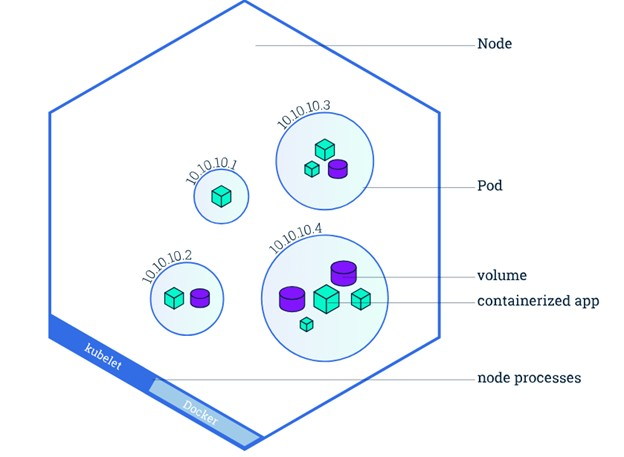

# Pods
- Assumptions: application is already developed and built into Docker images and available on Docker Repository like Docker Hub. And Kubernetes Cluster has already been set up and its working could be single or multi node setup, but all services need to be in running state.
- Aim is to deploy our application in form of containers on a set of machines that are configured as worker nodes in a cluster.
- However, Kubernetes does not deploy containers directly on the worker nodes, containers are encapsulated into a Kubernetes object known as pods.
- A **pod** is a single instance of an application, it is the smallest object that you can create in Kubernetes. We can create multiple pods with instances of same application on same node. Or we can create new node and a pod if current node has no sufficient capacity.



- Pods usually have a 1 to 1 relationship, with containers running your application. To scale up, we create new pods, and to scale down you delete existing pods. We don’t add additional containers to an existing pod to scale your application.
- Multi-Container Pods: A single pod can have multiple containers if they are not of the same kind.
- We need to define what containers a pod consists of Containers. Containers in pod will have access to same storage, network, and namespace as they will be created and destroyed together.
- **kubectl run nginx --image nginx**: deploys docker container by creating a pod (first nginx is the pod), at first it automatically creates pod and deploys an instance of nginx docker image, to get the image nginx we need to mention **--image** parameter then it’ll be downloaded from Docker Hub.
- **kubectl get pods**: list pods in our cluster, where we have 2 status containers creating and running.
- **kubectl describe pod nginx** : provides more information as compared to get command.
- **kubectl get pods -o wide** : provides information like node where the pod is running and IP address of pod.
- **kubectl get nodes -o wide**: To know the version of OS on which the Kubernetes nodes are running
- **kubectl run --generator** : created pod instead of deployment.
- **kubectl create deployment nginx –image+nginx** : creates a deployment using imperative command.

## YAML in Kubernetes
- Kubernetes uses YAML files as inputs for the creation of objects such as pods, replicas, deployments, services, etc. All of these follow a similar structure.
- A Kubernetes definition file always contains four top/root level required fields the API version, kind, metadata, and spec.

```YAML
apiVersion: v1
kind: pod # type of object that we want to create
metadata: # details about object, in the form of dictionary
	name: myapp-pod # string value
	labels:   # labels is dictionary within metadata dictionary.
		app: myapp
		type: front-end
spec:
	containers: # list/array
-	name: nginx-container
image: nginx
```

- **kubectl create -f pod-definition.yml** : creates the resource only if it doesn’t exist, if it exists already it will throw an error
- **kubectl get pods** - gives list of pods
- **kubectl describe pod myapp-pod** - detailed description of a pod
- **kubectl apply -f pod.yaml** # used to create a new resource, or update an existing resource.
- **kubectl edit pod podname**: we can edit anything in the existing pod, by using Insert mode and save it like :wq.
- **kubectl delete pod podname** - deletes the mentioned pod.
- **kubectl run redis --image=redis --dry-run=client -o yaml > redis.yaml** : create a pod named redis with image name redis and create output in YAML file.
