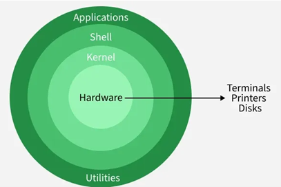

# Linux Architecture

Linux architecture is a layered structure consisting of hardware, the kernel, system libraries, the shell, and applications.

---

## 1. Hardware
The physical components of the computer, such as the CPU, RAM, hard drive,network interfaces and other input/output devices.  
It is the foundation upon which the rest of the system is built.

---

## 2. Kernel
The core of the operating system that manages system resources and acts as the interface between hardware and software. It runs in protected memory area called **Kernel Space** giving it full access to system's hardware.  
It handles low-level tasks like:

- Process Management: Manages execution and termination of processes, allowing multiple applications to run concurrently.
- Memory Management: Handles allocation and deallocation of memory.
- Device Management: Interacts with hardware through specific device drivers which are loaded as modules into kernel.
- File System Management: Manages how data is stored, retrived and organized on storgae devices.
- Networking: Manages network communication and protocols (like TCP/IP)

### **Types of Kernels**
- **Monolithic Kernel**  
- **Hybrid Kernels**  
- **Exokernels**  
- **Microkernels**

---

## 3. Shell
A command-line interpreter that acts as an interface between user and the kernel.  
It takes commands from the user, translates it into intsructions (system calls) that the kernel can understand and execute.

**Examples:** Bash (Bourne Again Shell), Zsh and Ksh

---

## 4. Application
User-level programs such as desktop environments, text editors, web browsers, games and other software that run in user space.

---

## 5. System Libraries
Pre-written functions that applications can use to interact with kernel services without writing direct kernel code. The most common one is GNU C Library (glibc)

---

## 6. System Utilities
System utilities are essential tools provided by Linux to manage and configure the system (ls,top,df, ifconfig).  
These utilities help with tasks such as:

- Installing software  
- Configuring networks  
- Monitoring performance  
- Managing users and permissions  

They simplify system administration and help maintain the system efficiently.
